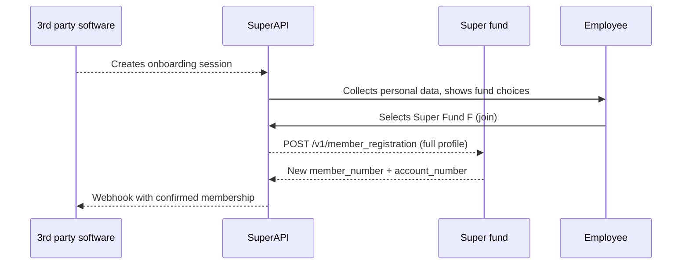

# Grow

This guide explains the Grow capability, which enables your fund to accept new members during an employer’s onboarding flow.

## About Grow

Grow enables a super fund to:

1. Open a new member account in real time when an employee selects your fund.
2. Return the new membership details to the employer so payroll contributions can commence immediately.
3. Capture verified personal data at source, reducing manual processing and follow‑up.

A successful implementation hinges on a member registration service that can accept a fully‑populated member file from SuperAPI and respond with the new account details.

## Integration paths

| Method                           | Who builds it | Key tasks                                                                                                           | Typical effort                   |
| -------------------------------- | ------------- | ------------------------------------------------------------------------------------------------------------------- | -------------------------------- |
| Member Registration API     | Super fund    | Expose HTTPS endpoint, implement auth, create member record in core system, send response.                          | Medium – ideal if fund has APIs. |

> Note: We do have other integration paths that are not listed here. Please contact us to discuss them.

## Data available for registration

The table below lists possible fields that SuperAPI can supply when creating a new membership. Your fund can decide which of these to accept or treat as optional, depending on your internal rules and product design.

| Field                    | Notes                                                                                                                                                           |
| ------------------------ | --------------------------------------------------------------------------------------------------------------------------------------------------------------- |
| `tfn`                    | Unique to the individual and required by most funds for ATO matching and contribution processing. If you accept TFN exemptions, those will be supplied instead. |
| `first_name`             | Employee’s given name.                                                                                                                                          |
| `middle_name`            | Optional middle names or initials if captured.                                                                                                                  |
| `family_name`            | Employee’s surname or family name.                                                                                                                              |
| `other_name`             | Previous surnames or aliases that may assist with identity checks.                                                                                              |
| `date_of_birth`          | ISO 8601 format (`YYYY‑MM‑DD`).                                                                                                                                 |
| `email`                  | Primary contact email, used for the welcome pack and ongoing communication.                                                                                     |
| `phone_number`           | Mobile preferred, supplied in E.164 format.                                                                                                                     |
| `address_line_1`         | Street address line 1.                                                                                                                                          |
| `address_line_2`         | Street address line 2, apartment or unit number if provided.                                                                                                    |
| `locality`               | Suburb or town.                                                                                                                                                 |
| `postcode`               | Four‑digit Australian postcode.                                                                                                                                 |
| `state`                  | Australian state or territory abbreviation (e.g. VIC).                                                                                                          |
| `gender`                 | Included only if collected during onboarding.                                                                                                                   |
| `employment_start_date`  | Useful for insurance eligibility calculations.                                                                                                                  |
| `contribution_frequency` | Weekly, fortnightly, monthly, etc., to inform default insurance cover.                                                                                          |

> Tip: Accepting as many of the higher‑quality identity fields as possible (for example TFN, date of birth, email and phone number) helps prevent duplicate memberships and reduces friction for both the member and your operations team.

## High‑Level flows

### API flow



#### Endpoint

```
POST /v1/member_registration
Content‑Type: application/json
```

##### Required headers

These are dependent on the auth flow that is agreed.

| Header           | Notes                                           |
| ---------------- | ----------------------------------------------- |
| `X-Auth-Key` | Api key          |


##### Successful response

```json
{
  "member_details": {
    "member_number": "12345678",
  }
}
```

A member number is the minimum amount of data that we require to process the onboarding. You are welcome to return additional data which we can surface to the employee. 

##### Error handling

| Status        | When to use                         | Retry guidance                                              |
| ------------- | ----------------------------------- | ----------------------------------------------------------- |
| `400`         | Malformed JSON or failed validation | No retry                                                    |
| `401` / `403` | Authentication failed               | No retry until credentials fixed                            |
| `429`         | Rate limit exceeded                 | Retry after `Retry‑After` seconds                           |
| `5xx`         | Temporary server issue              | SuperAPI will retry with exponential back‑off up to 3 times |

##### Security and compliance
* **Transport**: All traffic must use TLS 1.2+.
* **Authentication**: We support many authentication flows; our preference is JWT generated from pre-shared keys.

##### Versioning and change control
* The API is versioned via the URL, e.g. `/v1/member_registration`.
* Backwards‑compatible changes are announced at least 30 days in advance.
* Breaking changes require 90 days notice.