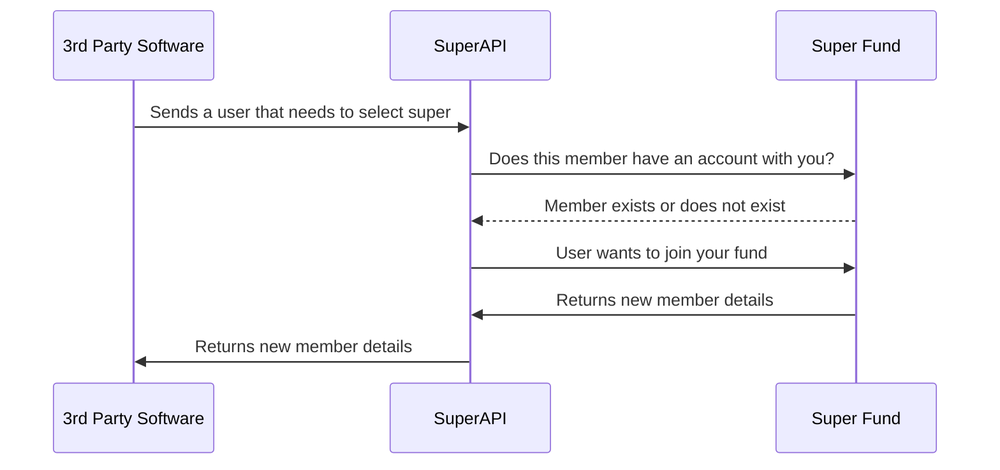

# SuperAPI Fund Implementation Overview

This guide provides an overview of how the SuperAPI product integrates with a super fund. It is not intended to be a detailed implementation guide and therefore contains no specific technical details about how to integrate SuperAPI. However it does serve as an overview of the integration process so that the effort and time required to perform the implementation can be estimated easily and accurately.

This document can be read by anyone and contains no sensitive information. Those that will get the most out of this document are:

- Software engineers or managers of software engineers working at superfund's
- Anyone who requires an understanding of the scope of effort required to implement SuperAPI.

## What is Super API?

SuperAPI is a platform that integrates super funds and HR software products together by providing a service which allows HR software products to easily onboard employees that need to make superannuation selections.

The SuperAPI platforms allows your fund to:

1. Display to the employee details about your fund if they are a member when they are starting a new role at a company.

2. Be shown to employees that are new to the market or those seeking a new fund.

3. Be shown as the default fund of an employer to users making a super selection choice.

4. Get leads from members that are interested in rolling over their funds.

5. Provide additional information about your fund to those that are reselecting or joining your fund.

<!--@include: @/parts/getting_help.md-->
<!--@include: @/parts/terminology.md-->

## An example super selection

The following diagram details how the SuperAPI bridges between Super Funds and Employers.

Here we can see the following steps:

1. Our **3rd Party Software** partner sent us an **Employee** who needed to select which super fund they belong to, we created them a **Super Selection Session**
2. We check with the **Super Fund Partner**'s linked to SuperAPI if they have an existing account for the **Employee** making a **Super Selection Session**
3. They return to us if they have a **Member** that matches that user making their super selection.
4. In the case that an **Employee** wants to join your fund, we send you details about them and you provision a new member account for them.
5. We turn the final payload to the **3rd Party Software**, they now have all the details required to ensure payroll can be paid by the **Employer** to the **Employee**.

## How do we integrate funds?

Super funds are integrated into SuperAPI in two ways. You may provide one or both of these integrations. Implementing both will ensure that you get the full value out of the SuperAPI integration.

We have some flexibility in the way that these fund integrations are performed and can conform to an authentication / authorisation system that may already exist. All integrations require two high level touch points however, these are:

### [Member lookup (Retain)](/funds/retain/index.html)

The first integration is the ability for us to lookup and find if a member exists. When a **3rd Party Software** requires a user to make a **Super Selection Session** they will send us a payload of details about the **Employee**. Before they send us these details, they have verified that the user owns the email address and phone number associated with that user. We then use these authenticated details to check with each of the funds that have a link with SuperAPI, if a **Member** with those details exists. If a member does exist, we show these details prominently to the user making it easy to reselect the fund.

### [Member creation (Grow)](/funds/grow/index.html)

The second integration is the ability for us to create a member within the fund. This is used when the user decides to join a new fund. They might be new to the workforce or looking for a change. In both cases, it is possible for the user to select a super fund and register as a new member. The purpose of the integration is to register the employee as a new member with the fund, and return the necessary details in order to populate the employer's payroll system with enough information to begin making employer contributions to the super fund.

### Creative

When integrating into SuperAPI your funds creative will be used according to its brand guidelines. Please supply any creative, brand kits etc to us when the implementation process starts.

### Implementation timeline

A typical implementation into SuperAPI can occur very quickly if APIs are already available for member lookup and creation, provided they follow standard best practices.

## Security

As we are dealing with personally identifiable information, the security of the SuperAPI system is paramount. Therefore, we have adopted the following security posture:

### Platform

Our platform implements security best practices where possible. While not currently ISO27001 certified, we are in the process of achieving this accreditation and expect to have it in place early next year. A security framework like ISO27001 is not enough by itself to guarantee a secure system and as such, we implement best practices from within the software engineering industry that may not be explicitly mentioned in the ISO27001 framework. A good example of this is code signing to ensure that all code integrated into the product originates from a developer that possesses a unique key which identifies them as the code author.

To gain an overview of our security implementation, please see our [Security FAQ](https://docs.superapi.com.au/security/faq/index.html)

### Sensitive data handling and retention

A question we get asked frequently is around how we handle sensitive data in our system, sensitive data being both PII data (names, addresses etc) and government issued unique identifiers, i.e. TFNs. In short, we hold onto this data for the shortest amount of time possible (usually measured in minutes) that is required for us to perform our super selection process and satisfy our legal requirements around auditing. Where we manage data that can't be deleted, e.g. login attempts, we take great care to ensure that the data logged is stripped of identifiable information.

To explore this in greater detail, please see our [Data Retention Policy](https://docs.superapi.com.au/security/super_api_data_retention_policy/index.html)

## Support

If you need to contact us for support, questions or anything at all related to the integration of your fund into SuperAPI, please reach out to support@superapi.com.au or simply call us, 0405 472 748.
