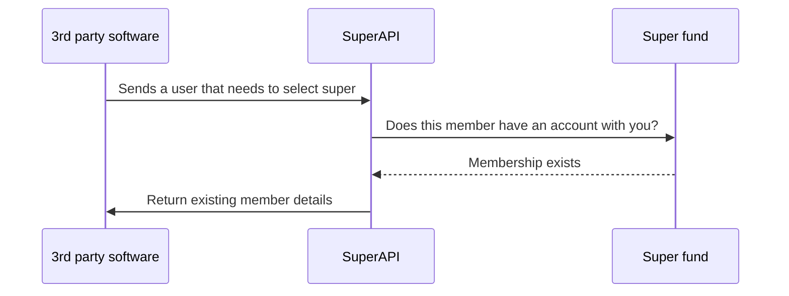
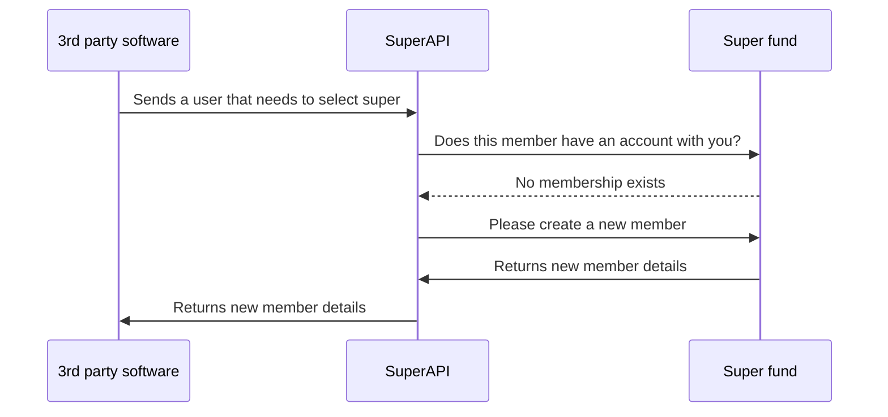

# SuperAPI Fund Implementation Overview

This document outlines how SuperAPI integrates with a super fund. It is not a step‑by‑step implementation manual and includes no low‑level technical detail. Instead, it offers a high‑level view of the integration process so that the time and effort required for implementation can be estimated with confidence.

This document will be more useful to:

- Software engineers or engineering managers working at super funds.
- Stakeholders who need to understand the scope of work involved in implementing SuperAPI.

## What is SuperAPI?

SuperAPI connects super funds to HR and payroll software, allowing employees to make their superannuation choice quickly and securely during onboarding.

The platform enables your fund to:

1. Show existing members their fund details when they start a new job.

2. Appear to employees who are new to the workforce or looking to switch funds.

3. Be offered as an employer's default fund during the super choice process.

4. Receive leads from members interested in rolling over their balance.

5. Supply richer information to employees reselecting or joining your fund.

<!--@include: @/parts/getting_help.md-->
<!--@include: @/parts/terminology.md-->

## How do we integrate funds?

SuperAPI supports two integration touch‑points for super funds. You may implement either one, but adopting both unlocks the full value of the platform.

Each touch‑point can slot into your existing authentication and authorisation framework, so no major changes are needed to your current systems. The two options are:

1. **Member lookup (Retain)** – confirms whether an employee is already a member of your fund
2. **Member creation (Grow)** – registers a new member when an employee chooses to join your fund

## Example flows

### Fund retention

The following diagram shows how a member is retained with a fund that has integrated to SuperAPI.

The process runs as follows:

1. A third‑party software partner sends SuperAPI an employee who must choose a super fund. SuperAPI creates an onboarding session.
2. SuperAPI asks each linked fund whether the employee already has a membership.
3. Each fund responds, indicating whether a matching member record exists.
4. The employee chooses to stay with the fund.
5. SuperAPI returns the existing membership data to the third‑party software.

### Member creation

The following diagram shows how a new member is registered with a fund that has integrated to SuperAPI.

The process runs as follows:

1. A third‑party software partner sends SuperAPI an employee who must choose a super fund. SuperAPI creates an onboarding session.
2. SuperAPI asks each linked fund whether the employee already has a membership.
3. No membership exists
4. The employee chooses to join a new fund.
5. SuperAPI supplies the employee's verified details, and the fund provisions a new member account.
6. The fund returns the new member information, which SuperAPI relays to the third‑party software so the employer can begin payroll contributions to the new fund.

### Creative

When your fund integrates with SuperAPI, its branding is presented exactly as specified in your brand guidelines. Please supply logos, colour palettes, typography, and any other creative material at the start of the project so that our design team can prepare the interface.

### Implementation timeline

Where APIs for member lookup and creation already exist, a SuperAPI integration can usually be completed in a few weeks. If new endpoints or changes to authentication are needed, additional time will be required. We will agree on a detailed plan and timeline with your technical team during project initiation.

## Security

Protecting personally identifiable information is central to the SuperAPI platform. We follow recognised best practice and are on track to obtain ISO 27001 certification early next year (2025).

### Features

* Encryption in transit and at rest across all services
* Role‑based access control with least‑privilege defaults
* Continuous vulnerability scanning and annual penetration tests
* Segregated development, staging, and production environments
* Regular backup and disaster‑recovery testing

To gain an overview of our security implementation, please see our [Security FAQ](https://docs.superapi.com.au/security/faq/index.html)

### Sensitive data handling and retention

We retain all sensitive data, including personally identifiable information and Tax File Numbers, for the life of the platform. Continuous retention provides a secure repository that partners can consult when verifying historic events such as an employee's superannuation choice and satisfies statutory record‑keeping requirements under the Superannuation Industry (Supervision) Act.

All sensitive data are encrypted in transit and at rest. Access is strictly role based, logged, and reviewed regularly. Operational logs capture only the information needed for security monitoring and auditing, limiting exposure of personal details.

Data are stored solely in Australian data centres certified to ISO 27001 or an equivalent standard. Back‑ups are replicated to geographically separate locations, and the principle of least privilege is enforced across the infrastructure, supported by regular penetration testing.

## Support

If you need to contact us for support, questions or anything at all related to the integration of your fund into SuperAPI, please reach out to support@superapi.com.au or simply call us on 0405 472 748.