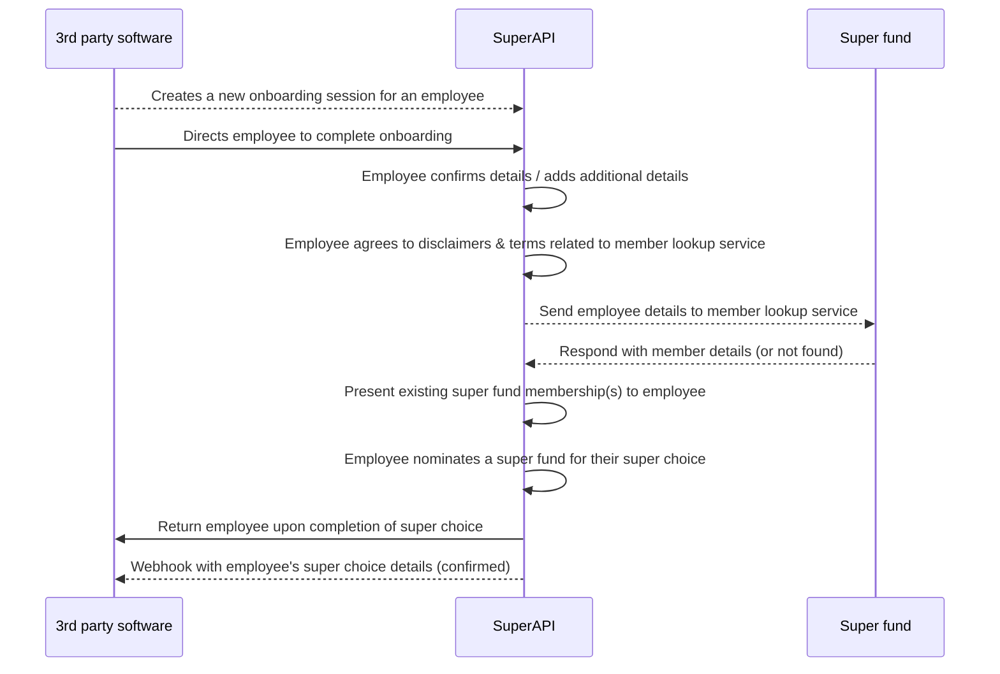

# Retain

This guide explains how to integrate with SuperAPI’s Retain capability so your fund can identify and engage existing members during employer onboarding.

## About Retain

Retain is a set of SuperAPI features that lets super funds:

1. Recognise existing members at the point of employer onboarding
2. Surface a member's current account so they can keep contributing to it
3. Improve retention, reduce account proliferation and cut rollover costs

The core requirement is a member lookup service that returns a match (or not) when SuperAPI submits a member’s details.

## Integration paths

| Method                      | Who builds it                                            | Key tasks                                                               | Typical effort                                |
| --------------------------- | -------------------------------------------------------- | ----------------------------------------------------------------------- | --------------------------------------------- |
| Member Lookup API       | Super fund                                               | Expose HTTPS endpoint, implement auth, return match result in real time | Medium – ideal if you already run public APIs |
| Hashed Lookup (offline) | Super fund provides data. SuperAPI takes care of lookups | Export and hash member data, deliver file on agreed schedule            | Low – no live infrastructure required         |

## Data used for matching

The following table contains some of the fields that can be used for matching. This is not an exhaustive list.

| Field            | Suitability | Notes                                                                            |
| ---------------- | ----------- | -------------------------------------------------------------------------------- |
| `tfn`            | High    | Unique to the individual and stable over time. Strongest single identifier. May have some legal requirements are use. |
| `date_of_birth`  | High  | Rarely changes and helps disambiguate people with similar names.                 |
| `email`          | High    | Often unique, but members may use personal or work addresses interchangeably.    |
| `phone_number`   | Medium  | Helpful when supplied in E.164 format, but users change numbers more frequently. |
| `first_name`     | Medium | Useful when combined with other fields; subject to spelling variations.          |
| `family_name`    | Medium  | Same considerations as first name; may change after marriage.                    |
| `postcode`       | Medium  | Adds context to address matching, though people move house.                      |
| `address_line_1` | Medium  | Valuable when combined with postcode, but formatting can vary.                   |
| `middle_name`    | Low     | Often omitted or inconsistently captured, so less reliable.                      |
| `other_name`     | Low     | Intended for previous names or aliases; rarely supplied.                         |
| `address_line_2` | Low    | Typically blank or used inconsistently (unit numbers, etc.).                     |

> Tip: Providing as many high‑suitability fields as possible will improve the match rates.

## High‑Level flows

### API flow



#### Endpoint

```
POST /v1/member_lookup
Content‑Type: application/json
```
##### Required headers

These are dependent on the auth flow that is agreed.

| Header           | Notes                                           |
| ---------------- | ----------------------------------------------- |
| `X-Auth-Key` | Api key          |

##### Successful response

```json
{
  "member_found": true,
  "member_details": {
    "member_number": "12345678",
  }
}
```

If your lookup service supports probabilistic matching, you can replace the boolean `member_found` flag with a decimal `confidence` value from 0.00 (no match) to 1.00 (certain match). SuperAPI will display the account automatically when the score is above an agreed threshold (for example 0.80). Scores below the threshold trigger a prompt asking the employee to check or update their details, giving them a chance to improve the match before continuing.

##### No match response

```json
{
  "member_found": false
}
```

##### Error handling

| Status        | When to use                         | Retry guidance                                              |
| ------------- | ----------------------------------- | ----------------------------------------------------------- |
| `400`         | Malformed JSON or failed validation | No retry                                                    |
| `401` / `403` | Authentication failed               | No retry until credentials fixed                            |
| `429`         | Rate limit exceeded                 | Retry after `Retry‑After` seconds                           |
| `5xx`         | Temporary server issue              | SuperAPI will retry with exponential back‑off up to 3 times |


##### Security and compliance
* **Transport**: All traffic must use TLS 1.2+.
* **Authentication**: We support many authentication flows, our preference is JWT generated from pre-shared keys.

##### Versioning and change control
* The API is versioned via the URL, eg. `/v1/member_lookup`.
* Backwards‑compatible changes are announced at least 30 days in advance.
* Breaking changes require 90 days notice.

### Hashed data flow
Please contact us further details of how our hashed data matching functions.

<!--@include: @/parts/getting_help.md-->