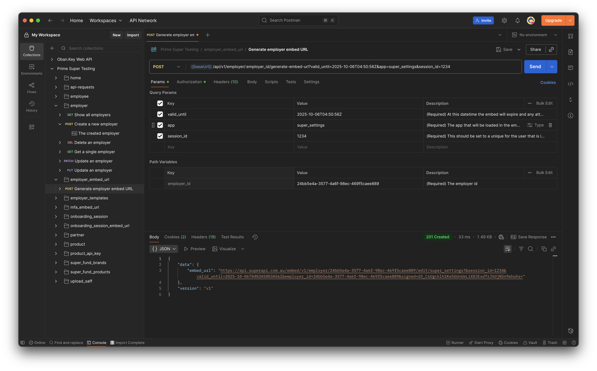
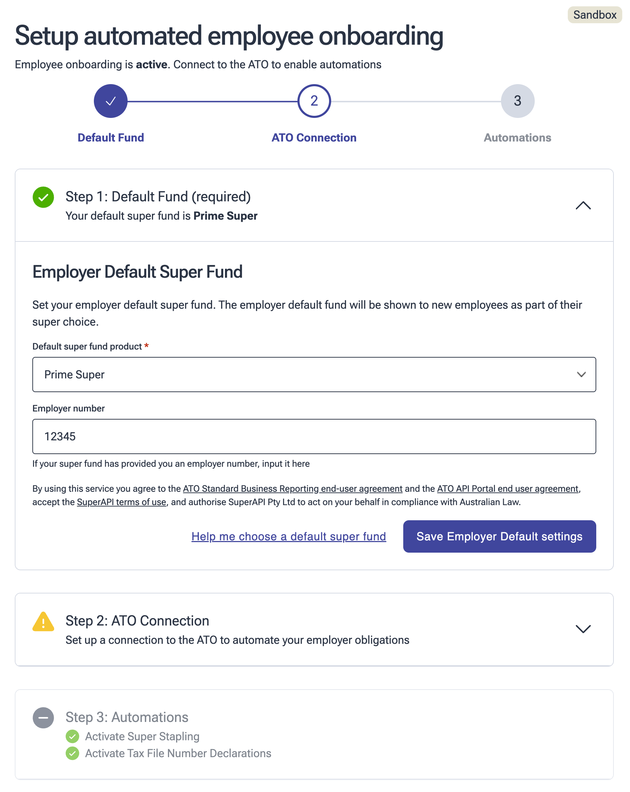
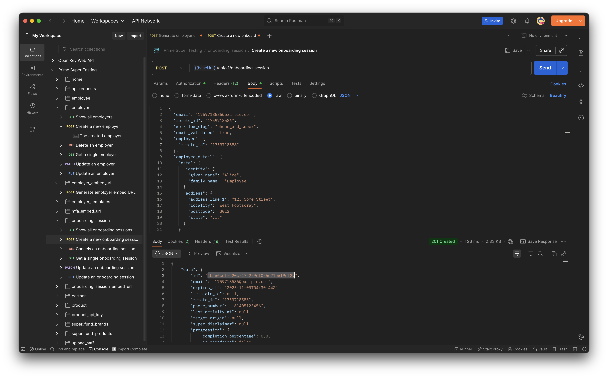
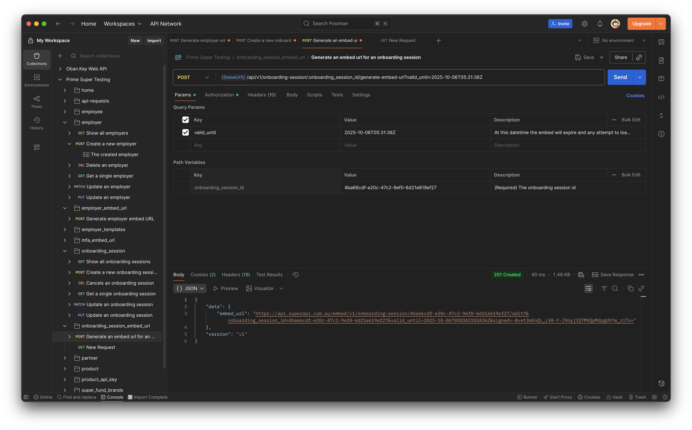
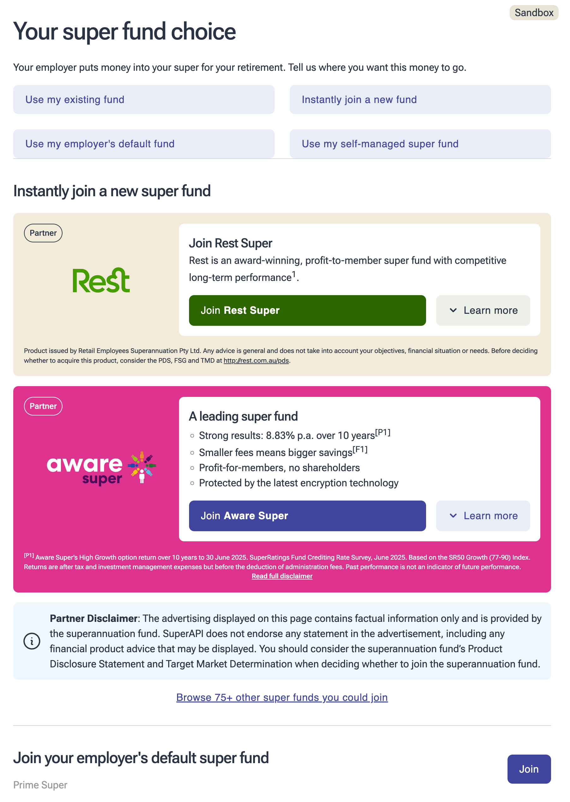

# Testing your integration with SuperAPI  

This guide explains how to test your fund’s integration with the SuperAPI platform. You can test all integrations and flows through this method.  

Although tests run in our sandbox environment, everything you see mirrors the production system. The only difference is that external systems (e.g. the ATO Stapling API) return simulated responses and no real-world changes occur.  

## Testing using Postman  

We’ll provide you with a [Postman collection](https://www.postman.com/) pre-configured to use a dedicated SuperAPI testing account. By adjusting the data you send, you can create onboarding session scenarios that mimic what an employee will experience. These scenarios cover all our integrations (retain, promoted default and grow tiles).  

## Setting a default fund  

To control which fund appears as the default in an onboarding session, use the employer embed to configure the default fund for that employer.  

Update the `valid_until` field to a UTC datetime up to two hours in the future. You can use [this site to find the current UTC time](https://www.utctime.net/).  

Once you’ve generated a valid embed URL, load the employer embed and set the default fund to your fund or another fund as needed.  

## Creating an onboarding session  

After configuring the default fund, you can create an onboarding session to test the onboarding experience.  

If you want to test features such as retain (matching existing members), adjust the details you send to the onboarding session. This is the data SuperAPI uses to match employees.  

When you’re ready to view the onboarding session, generate an embed URL for it:  

Load the URL in your browser to access the onboarding session:  

