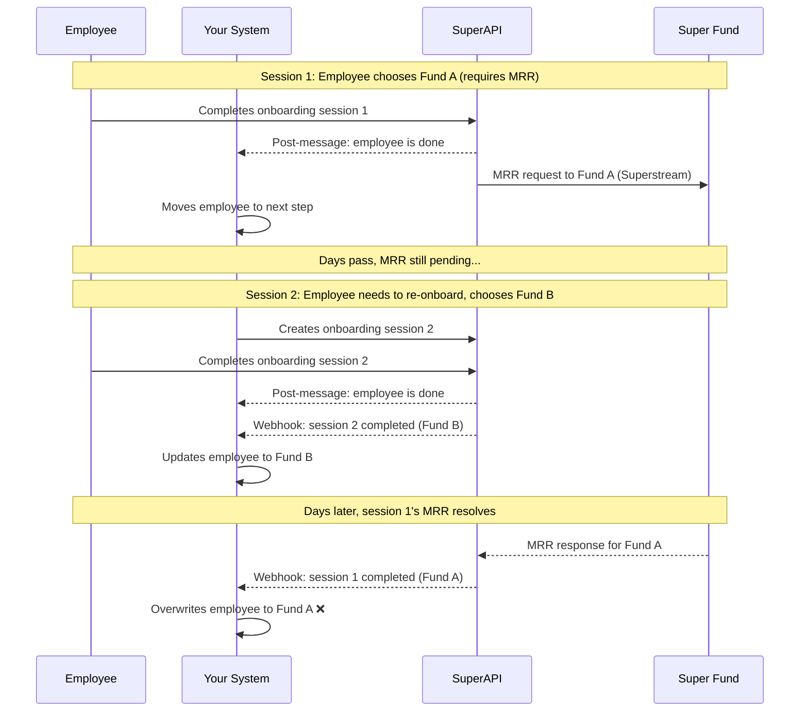

# Common Gotchas

This guide covers the most common issues partners run into when integrating with SuperAPI. Each section describes the problem, why it happens, and how to avoid it.

## Webhook race conditions

When an employee finishes interacting with the onboarding embed, SuperAPI emits a **post-message event** via the iFrame. This tells your system that the employee is done and it's safe to move them to the next step in your UI. However, this does not mean SuperAPI has finished processing. If we need to register a member with a fund via an MRR sent on the Superstream network, this can take a few days to resolve. The `onboarding_session_completed` webhook fires once SuperAPI has fully resolved all data, including any pending fund registrations.

The race condition occurs when a second onboarding session is created before the first has fully completed. Here's how it plays out:



In this scenario, the partner system ends up with Fund A even though the employee's most recent choice was Fund B.

### How to avoid this

Rather than relying on individual `onboarding_session_completed` webhooks to update your records, use the **employee endpoint** to fetch the current state of the employee. The employee endpoint always reflects the latest state in SuperAPI regardless of which onboarding session produced it, so you don't need to worry about older sessions overwriting newer choices.

Alternatively, you can handle this in your own system by preventing new onboarding sessions from being created until the previous one has fully completed (i.e. you've received its `onboarding_session_completed` webhook).

For more detail on how onboarding sessions progress through their lifecycle, see the [lifecycle of an onboarding session](/software_partners/explanations/lifecycle_of_an_onboarding_session/index.html) explanation guide. For a full list of webhook events, see the [list of webhooks](/software_partners/references/list_of_webhooks/index.html) reference.

## Onboarding sessions cause side-effects

Creating an onboarding session is not a passive operation. If an onboarding session is created but the employee never completes it, SuperAPI will eventually run abandonment flows. These flows attempt to resolve the employee's superannuation by stapling them to an existing fund or registering them with the employer's default fund. This happens automatically after a period of inactivity (see the [lifecycle of an onboarding session](/software_partners/explanations/lifecycle_of_an_onboarding_session/index.html) for detail on when this occurs).

The problem arises when an employee already has superannuation details recorded in your system - for example, entered by a bookkeeper. If an onboarding session is created and left incomplete, the abandonment flow will resolve the employee's fund independently. When you fetch the completed session data, it may overwrite the details that were already correct in your system.

### How to avoid this

- **Be intentional about creating onboarding sessions.** Don't create them speculatively or as part of a test flow in production. Each session will eventually trigger real side-effects if left incomplete.
- **Pass existing super fund details when creating the session.** If you already know the employee's super fund, include it in the onboarding session creation payload (see the [API reference](https://api.superapi.com.au/swaggerui) for the available fields). SuperAPI will return this data rather than stapling or defaulting the employee.
- **Delete sessions you no longer need.** Use the DELETE action on the onboarding session endpoint to clean up sessions that were created in error. Note that sessions in certain states cannot be deleted if they are waiting for data to be returned - see the [lifecycle of an onboarding session](/software_partners/explanations/lifecycle_of_an_onboarding_session/index.html) for more detail.

## Remote ID confusion

Three entities in SuperAPI have a `remote_id` field: **employers**, **employees**, and **onboarding sessions**. Each one serves the same purpose, a reference back to the corresponding record in your system, but they refer to different things.

| Entity | `remote_id` should map to |
| --- | --- |
| Employer | The organisation/company/business in your system |
| Employee | The employee/person in your system |
| Onboarding session | The specific onboarding task or workflow instance in your system |

The confusion tends to arise when creating an onboarding session, because the payload includes both a session `remote_id` and a nested `employee.remote_id`:

```json
{
  "employer": { "id": "..." },
  "employee": { "remote_id": "employee-1" },
  "remote_id": "onboarding-1",
  "email": "employee@example.com",
  "workflow_slug": "standard_onboarding"
}
```

These are two different fields referencing two different records in your system. Using the same value for both won't cause an error on our side, but it will make debugging harder - both for you when processing webhooks and for us when helping you troubleshoot.

::: info
The `remote_id` is a convenience. We include it in webhook payloads so you can look up the relevant record in your system without needing to maintain a mapping table. We also use it internally when debugging partner integrations. Uniqueness is enforced within the context of the parent entity: an onboarding session `remote_id` must be unique within the employee, an employee `remote_id` must be unique within the employer, and an employer `remote_id` must be unique within the product.
:::

### Creating employees separately

The `employee` key in the onboarding session payload is a convenience that lets you create the employee in a single operation. If you find the overlapping `remote_id` fields confusing, you can create the employee as a separate step first, then reference them by `id` when creating the onboarding session:

```json
{
  "employer": { "id": "..." },
  "employee": { "id": "employee-superapi-id" },
  "remote_id": "onboarding-1",
  "email": "employee@example.com",
  "workflow_slug": "standard_onboarding"
}
```

This makes it clearer which `remote_id` belongs to which entity, as the employee's `remote_id` is set at creation time and doesn't appear in the onboarding session payload at all.

For more detail on how to model SuperAPI entities alongside your own, see [understanding SuperAPI entities](/software_partners/explanations/understanding_super_api_entities/index.html) which includes examples of how to set up join tables between your system and SuperAPI.

## API key confusion

SuperAPI has two kinds of API keys: **partner keys** (prefixed `superapipartner_`) and **product keys** (prefixed `superapiproduct_`). Partners often mix these up, especially when trying to update infrastructure configuration like webhook URLs or target origins.

The difference is:

- **Product key** - used for day-to-day operations like creating employers, onboarding sessions, and generating embed URLs. This is the key your application uses in production.
- **Partner key** - used to manage how SuperAPI itself is configured. This means creating or updating products, including their webhook URLs and target origins.

::: tip
Not all partners need a partner key beyond initial setup. If your system uses a single product with a fixed webhook URL and target origin, you'll likely only need your product key for ongoing operations. Partner keys are primarily needed when you dynamically configure products, for example if you use vanity subdomains or run separate instances per customer.
:::

A common mistake is using a product key to update a product's webhook URL or target origin. These are partner-level operations and will return a `403` error. If you're getting a `403` when updating product configuration, check that you're using your partner key (`superapipartner_`) rather than your product key (`superapiproduct_`).

More detail about the partner vs product key distinction can be found in our [product keys and partner keys](/software_partners/explanations/product_vs_partner_api_keys/index.html) explanation guide.

<!--@include: @/parts/getting_help.md-->
