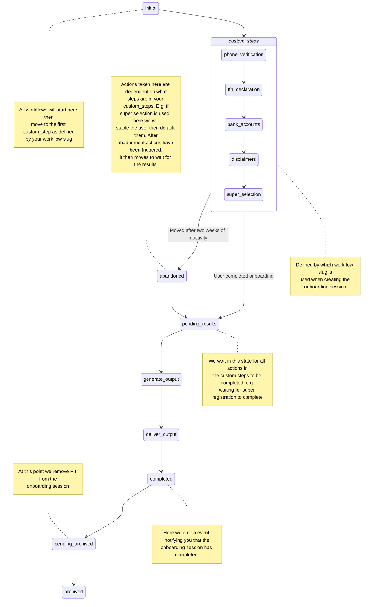

# Life cycle of an onboarding session

Unlike [other entities](/software_partners/explanations/understanding_super_api_entities/index.html) in the SuperAPI system, onboarding sessions follow a very defined life cycle of events as they designed to be created when we need an employee to take a discrete set of actions in the SuperAPI system vs say setting up some configuration as you might do with an employer. As such, we provide some additional webhooks which allow you take actions in your system based on how the user is progressing through the onboarding session. It's worth noting that an onboarding session is conceptually the same as a state machine (or rather a state chart as we nest state machines). Thinking about them like this may help with understanding how to model them in your system.

A diagram can speak for a thousand words:

One of the benefits of using SuperAPI is that we have abstracted away from you most of the logic that surrounds handling some of the more complex actions that need to be taken, e.g. MRR registration.

## Events that move the onboarding session workflow automatically

Workflow states can be moved by events outside of the users control. These are:

| Event                        | Effect                                                                                                                                                                                                      |
| ---------------------------- | ----------------------------------------------------------------------------------------------------------------------------------------------------------------------------------------------------------- |
| Abandoned                    | Fired after two weeks if the onboarding session has not been completed. Will trigger abandonment behavior then wait for the results. This for example will be to start the stapling and defaulting behavior |
| Archived                     | Fired after four weeks regardless of what state the onboarding session is. Any PII about the employee is removed at this step.                                                                              |
| Duplicate onboarding session | If another onboarding session is created while a previous one exists for the same workflow and employee, we immediately archive the existing onboarding session                                             |

## Outcomes

Each module in the workflow will record an `outcome` key which details the 'outcome' of the user interacting with that module. Outcomes for most modules usually fall into either a 'complete' or 'incomplete'. Take for example the bank accounts module, if the employee enters their bank account details and clicks next then the outcome of the bank account module will be that it was 'complete'.

One special exception to the complete / incomplete outcome is the `onboarding_session_super_selection` module as this has more possible end states. These outcomes are recorded in the following table along with some possible actions you may want to take in your system:

| Outcome                        | Reason                                                                                                                                                                                              | Possible actions                                                                                                                                                                                                                            |
| ------------------------------ | --------------------------------------------------------------------------------------------------------------------------------------------------------------------------------------------------- | ------------------------------------------------------------------------------------------------------------------------------------------------------------------------------------------------------------------------------------------- |
| complete                       | The user completed all steps required to provide details for payment to their nominated super fund.                                                                                                 | Submit the employees details to payroll                                                                                                                                                                                                     |
| complete_without_member_number | The user did not complete the form, we were unable to find their stapled superfund and we did not receive a response from sending a request (MRR) to join them to the employers default super fund. | Notify the employer to either collect superfund details directly from the employee, staple the employee or join the employee to their default fund. This is an uncommon outcome where the employer will have to manually resolve the issue. |
| incomplete                     | You requested details via the API about an onboarding session where the user is in the process of selecting a superfund.                                                                            | Wait for the user to complete their onboarding                                                                                                                                                                                              |
