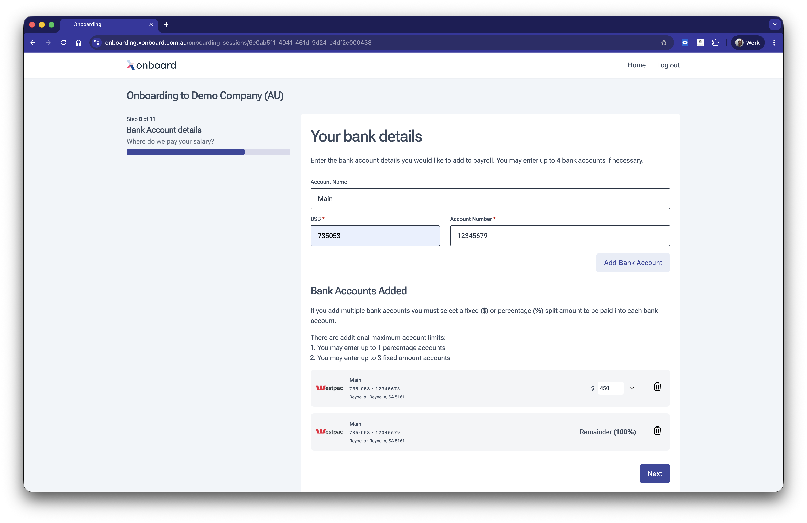

# Bank accounts

Capture bank account details and account payout splits.

## Features

* Validates BSB by matching against an authorised list of BSBs.
* Provides visual confirmation of selected banks by showing logos.
* Can handle restricting the allowed bank accounts to account for employer relationships with banks.
* Sophisticated "splitting" system allows for rules on money disbursement. 

## Coming soon

* Confirmation of payee integration for certainty on payroll payments.
* Inline bank account origination.