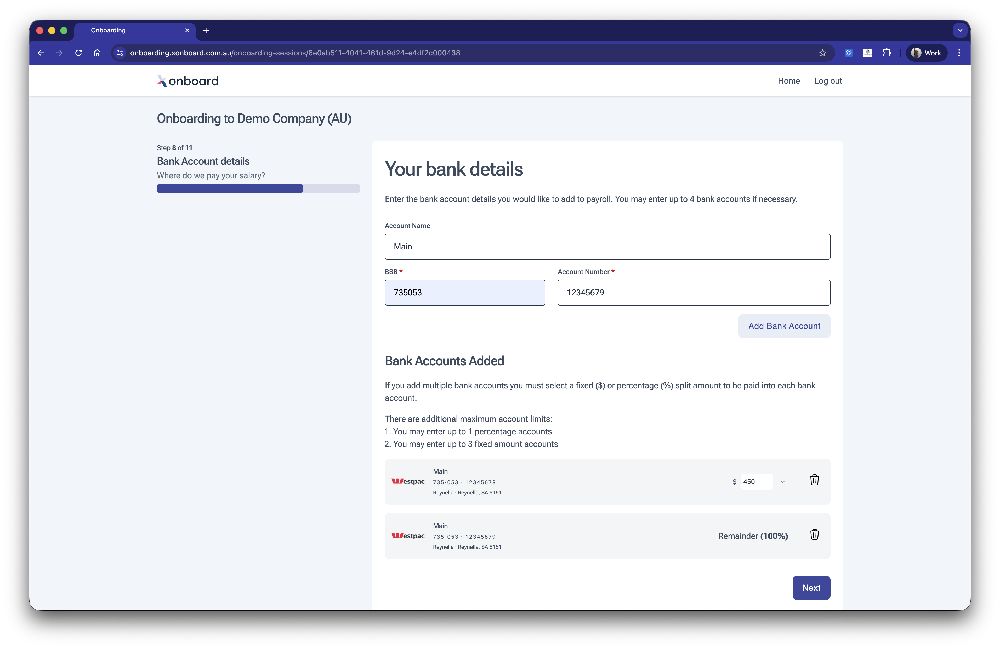

# Bank accounts

Collect payroll-ready bank account details with built-in validation, so employees are paid correctly from their first pay run. Employees can split pay across multiple accounts with flexible rules for fixed amounts and percentages.

## Features

* BSB validation against an authorised list with visual confirmation through bank logos.
* Configurable rules to restrict allowed bank accounts, number of accounts and splitting behaviour per integration.
* Flexible pay splitting across multiple accounts using fixed dollar amounts, percentages or a combination of both.
* Address automatically pre-populated from previous modules or data provided by the software partner.

## Coming soon

* Confirmation of payee integration for certainty on payroll payments.
* Inline bank account origination.