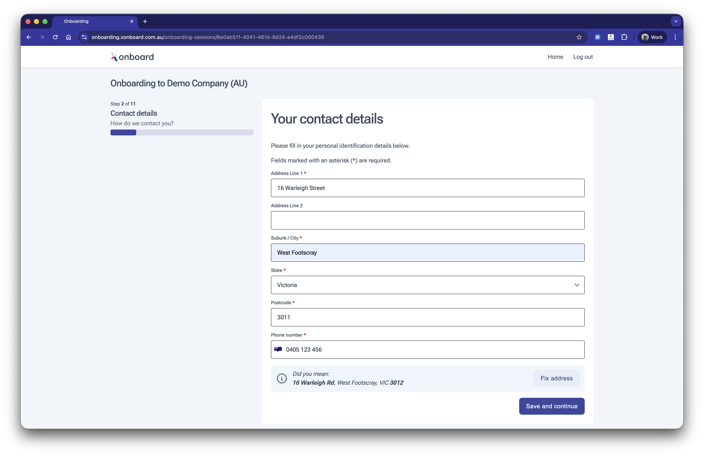

# Contact details

Get accurate employee addresses and phone numbers the first time. Smart address nudging helps employees correct typos and select verified addresses without blocking those whose address may not appear in major validation databases.

## Features

* Entered addresses are checked against known address databases and employees are nudged toward a verified match when one is found, without enforcing strict validation.
* Returns a confidence score on the address so your system can decide how to handle uncertain matches.
* Supports international phone numbers.
* Form data automatically encrypted and saved as each field is completed.
* Fields pre-populated from data provided by the software partner, reducing manual entry for the employee.