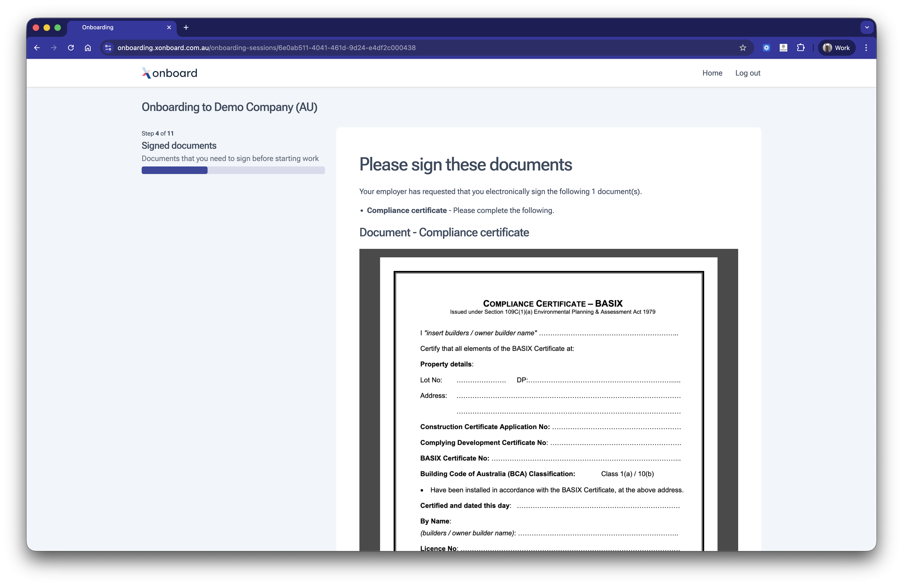

# E-sign

Get employment contracts, compliance certificates and other critical documents signed electronically as part of the onboarding flow — no separate tools or follow-up emails required. Employers provide the documents and employees review and sign them before starting work.

:::warning
This module is currently in beta testing on Xonboard and is likely to change before being released to software partners.
:::

## Coming soon

* Flexible template fields on documents (employee name, job title) so documents are customised to the employee onboarding.
* Integration with 3rd party document signing providers, e.g. Annature or Adobe e-sign.

[Missing something? Get in touch and tell us what you need.](https://superapi.com.au/contact/)