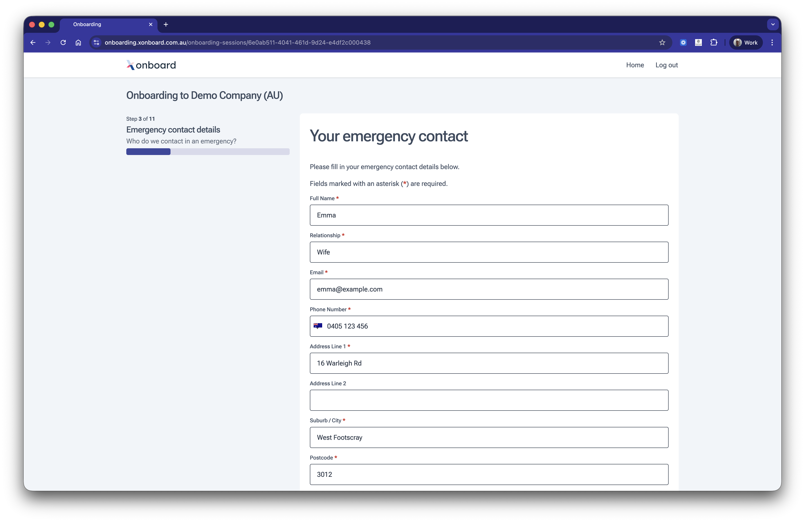

# Emergency contact

Ensure every employee has an emergency contact on file from day one. The form captures name, relationship, phone, email and address, with smart defaults that reduce effort for the employee.

## Features

* Address nudging checks entries against known address databases and suggests verified matches without enforcing strict validation.
* Returns a confidence score on the address so your system can decide how to handle uncertain matches.
* Form data automatically encrypted and saved as each field is completed.
* Address automatically pre-populated from previous modules or data provided by the software partner.

## Coming soon

No planned features. [Missing something? Get in touch and tell us what you need.](https://superapi.com.au/contact/)