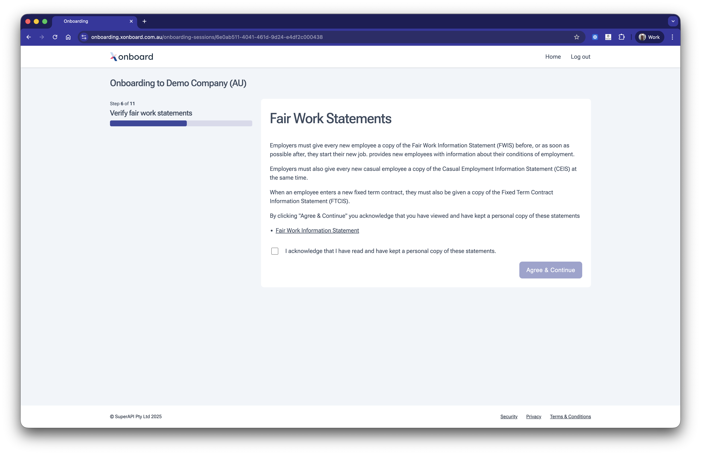

# Fair work statements

Meet your Fair Work Ombudsman obligations automatically. Employees are presented with the relevant statements during onboarding and must acknowledge them before continuing, giving employers a timestamped compliance record.

## Features

* Displays the Fair Work Information Statement (FWIS), Casual Employment Information Statement (CEIS) and Fixed Term Contract Information Statement (FTCIS) based on the employee's employment type.
* Records the date and time the employee acknowledged receiving the statements for audit purposes.

## Coming soon

No planned features. [Missing something? Get in touch and tell us what you need.](https://superapi.com.au/contact/)