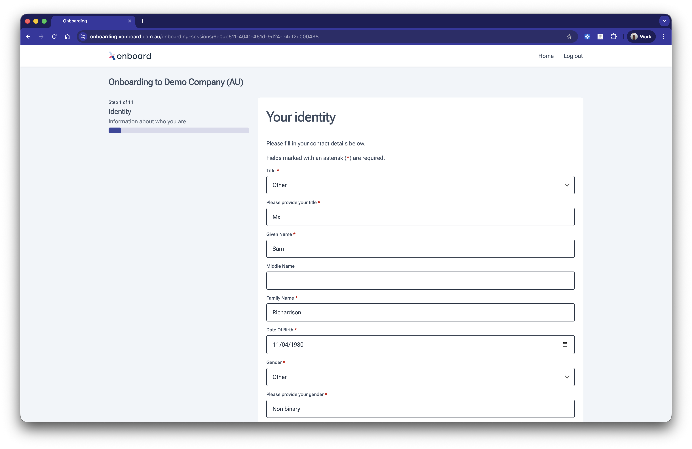

# Identity

This module allows capturing information about the identity of the employee.

## Features

* Standard gender and honourific dropdowns but with the option to input any gender or honourific required.
* Form data automatically encrypted and saved as each field is completed.
* Details automatically populated from information passed by the software partner.