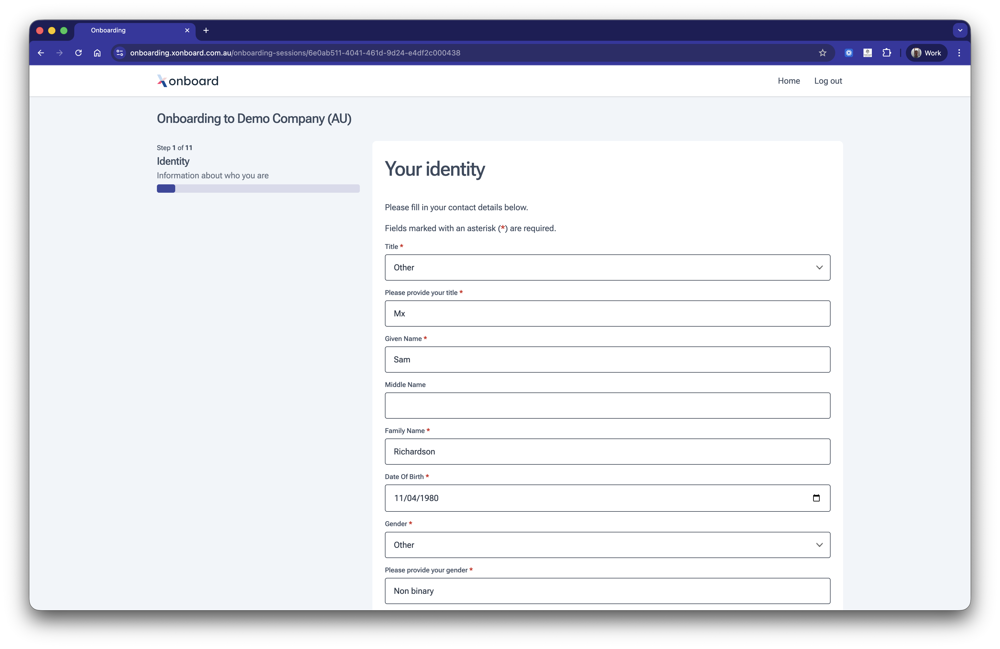

# Identity

Collect verified identity information upfront so employees only enter their details once. The form is inclusive by design, supporting custom gender and honourific inputs alongside standard options.

## Features

* Inclusive gender and honourific fields with the option to input any value.
* Form data automatically encrypted and saved as each field is completed.
* Fields pre-populated from data provided by the software partner, reducing manual entry for the employee.

## Coming soon

No planned features. [Missing something? Get in touch and tell us what you need.](https://superapi.com.au/contact/)