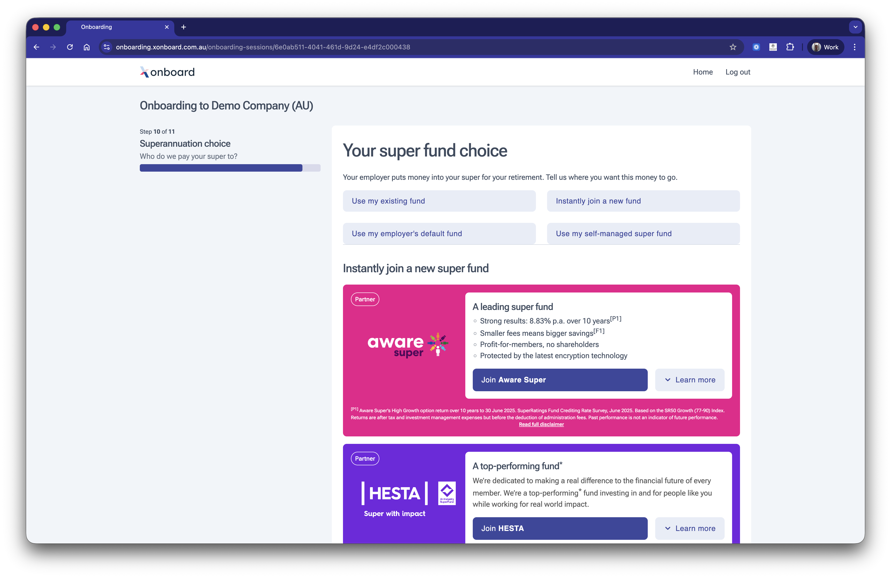

# Superannuation choice

Replace the paper super choice form with a guided digital experience. Employees can find their existing fund, join a new one or use the employer default all in a few clicks. Fund partnerships mean existing memberships are detected automatically and new memberships can be created inline, making super selection fast and frictionless.

## Features

* Automatic stapled super fund lookup via ATO integration, so employees are matched to their existing fund without manual input.
* Fund partnerships automatically detect existing memberships and allow employees to join a new fund inline.
* Supports 1000+ funds for employees to select from, including SMSF with eligibility validation.
* Automatic stapling and defaulting to the employer's nominated fund when ATO integration is enabled.
* Form data automatically encrypted and saved as each field is completed.
* Address automatically pre-populated from previous modules or data provided by the software partner.

## Coming soon

No planned features. [Missing something? Get in touch and tell us what you need.](https://superapi.com.au/contact/)
