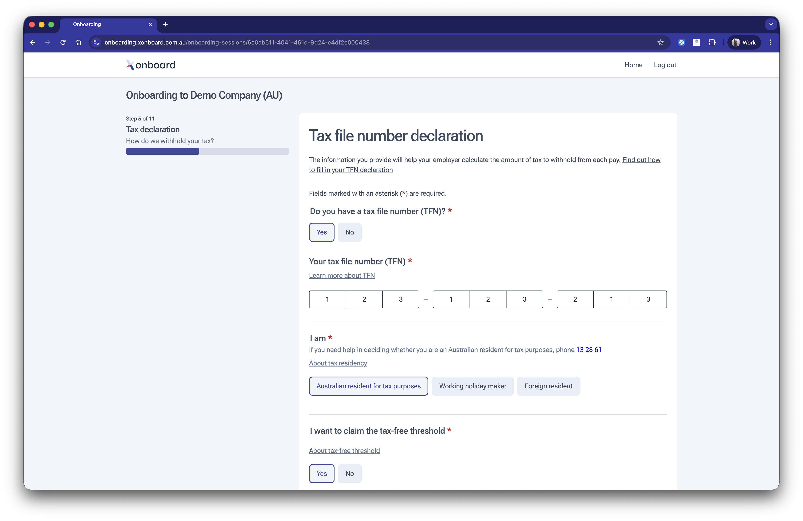

# Tax details

Replace paper TFN declaration forms with a guided digital experience that reduces errors and employee confusion. When ATO integration is enabled, the completed declaration is submitted automatically — removing manual processing entirely.

## Features

* Carefully designed form with clear guidance on residency status, tax-free threshold and TFN entry to minimise confusion.
* Tax declaration is automatically submitted to the ATO when ATO integration has been configured.
* Form data automatically encrypted and saved as each field is completed.
* Address automatically pre-populated from previous modules or data provided by the software partner.

## Coming soon

* EmployerTick integration to validate the TFN with the ATO.