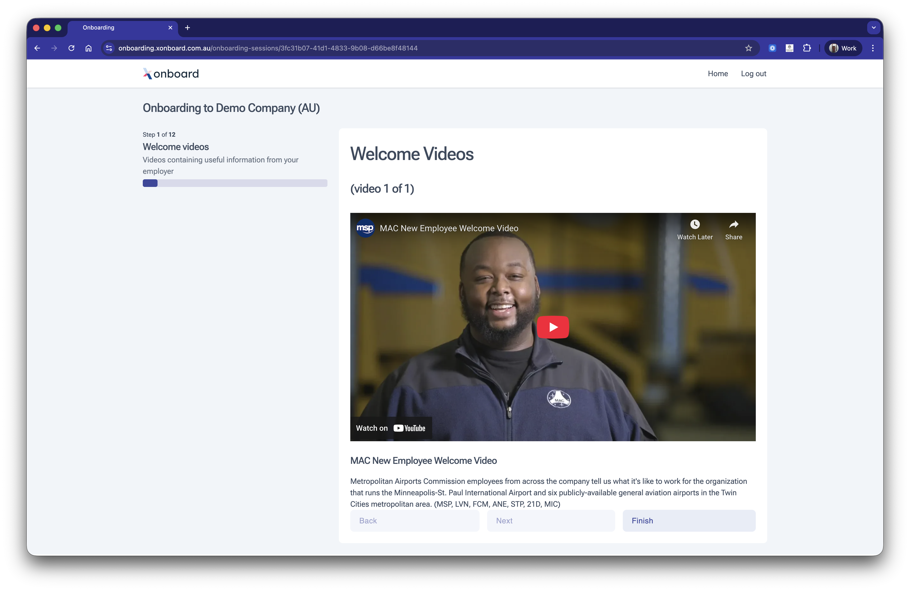

# Welcome videos

This module allows you to present videos to the employee onboarding before they commence the remaining steps in the onboarding journey. Use this to display welcome videos, training materials and other information required for the employee before they start their job.

## Features

* Use any YouTube video.
* Multiple videos presented in a sequence defined by the employer.

## Coming soon

* Use videos from more video providers (e.g. Vimeo)
* Private hosting of uploaded videos.