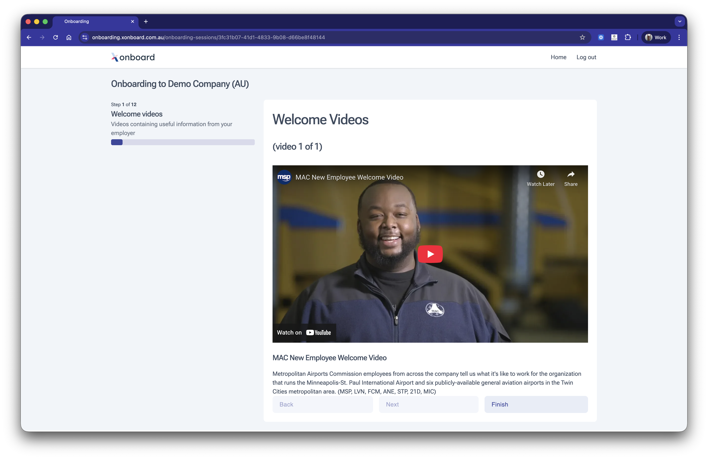

# Welcome videos

Set the tone for a new employee's experience before they fill out a single form. Welcome videos let employers deliver a personal introduction, training materials or company culture content right at the start of the onboarding journey.

## Features

* Embed any YouTube video directly into the onboarding flow.
* Present multiple videos in a sequence defined by the employer.

## Coming soon

* Use videos from more video providers (e.g. Vimeo)
* Private hosting of uploaded videos.

[Missing something? Get in touch and tell us what you need.](https://superapi.com.au/contact/)