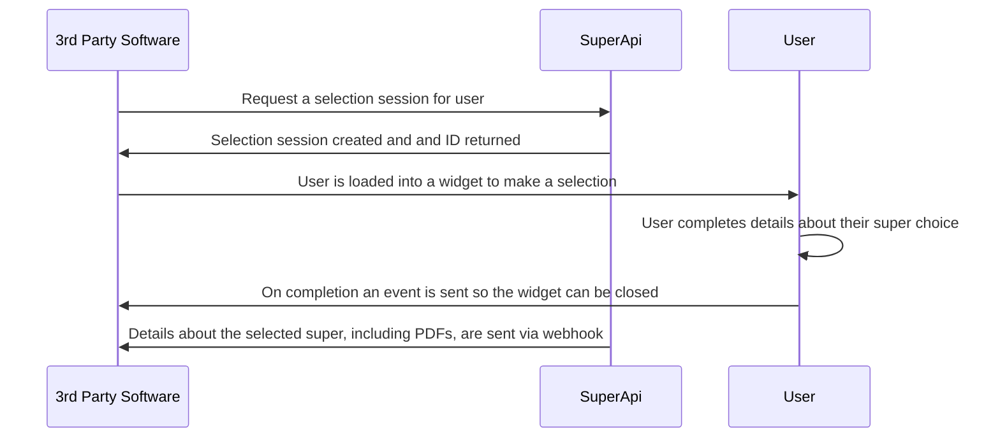

# SuperAPI Partner Implementation Overview

The following document provides a high level overview of the integration between SuperAPI and the 3rd party software that is embedding the SuperAPI. It is not intended to be an in-depth guide on how to integrate our product, rather, it serves to help developers understand the scope of SuperAPI and to begin to plan what effort is needed for integrating the SuperAPI.

## Introduction

### What is ‘super’?

Superannuation, or ‘super’, is the Australian Government mandated retirement savings scheme which requires all employees in Australia, including most visiting workers, to be paid 11% of their income in the form of a superannuation contribution. This superannuation contribution is paid by the employer, to the super fund nominated by the employee. The process for an employee to nominate their super fund is referred to as a ‘super choice’.

::: warning
Significant penalties, including criminal conviction, can apply to employers who fail to meet their obligations under the Australian Superannuation Act.
:::

### Why SuperAPI?

SuperAPI’s software product provides an easy to integrate web service which

1. Reduces the development effort required when building for the Australian market.
2. Complies with the choice of superfund regulations as defined by the Australian Tax Office (see [offering employees a choice](https://www.ato.gov.au/Business/Super-for-employers/Setting-up-super-for-your-business/Offer-employees-a-choice-of-super-fund/))
3. Delivers ongoing compliance as regulation around superannuation changes without incurring development overhead for the embedding partner.
4. Reduces effort and errors for HR and payroll teams in onboarding new employees.
5. Provides an auditable system of record for employers and partners to demonstrate compliance.

By integrating SuperAPI, you ensure compliance with both current and future regulatory requirements, in accordance with Australian Employment Law and the Superannuation Act.

Along with meeting the standards required by the regulator, we improve the accuracy of captured data and reduce the administrative burden for human resources and payroll teams by removing manual handling of the super fund selection process.

We provide these services by working with:

- The Australian Tax Office ([ATO](https://www.ato.gov.au/))
- The Australian Prudential Regulatory Authority ([APRA](https://www.apra.gov.au/))
- Super funds, plus the entities that support them
  - Administrators
  - Trustees
  - Clearing houses
  - Registries
- Self managed super funds ([SMSF](https://www.ato.gov.au/Super/Self-managed-super-funds/))

In Australia these entities collectively comprise the industry infrastructure and messaging ‘rails’ on which employee super fund selection must be administered.

<!--@include: @/parts/getting_help.md-->
<!--@include: @/parts/terminology.md-->

## Data transport and communication

Before delivering into specifics, you should understand the flow and format of data that is sent between the SuperAPI and the **3rd Party Software**. The following diagram outlines the process of a **Employee** making a super selection in a **Super Selection Session**.

### API architecture and message payloads

All our APIs, where appropriate, use a RESTful architecture and are secured by passing your **API Key** when making requests.

Message payloads are JSON with timestamps encoded as strings in UTC ISO8601 format (i.e. `2023‐08‐22T11:44:02Z`)

## User identification and data return

In most cases, the **Employee** will select a super fund that they are already a member of. In the event they are new to the workforce or they opt to change their super fund, a new registration is created with the super fund. In all cases we validate the provided member number before returning it to the **3rd Party Software**.

If a user is joining a new super fund or changing super funds, the creation of a new member in a superfund is an asynchronous process that can take anywhere from 5 minutes to a few days. As a result, you must plan to receive member data in the future for a **Employee** rather than when the **Employee** completes the **Super Selection Session** in your application.

### Super selection sessions

A **Super Selection Session** represents a choice made by a **Employee** for the super fund that they want to use. Please don’t confuse this with a browser session, rather, the **3rd Party Software** will create this session by calling the SuperAPI which will return a UUID which can then be given to our **SuperAPI JavaScript Library** which is embedded in your frontend. Once created, we guide the user on a journey to either find their current super fund or to pick a new super fund.

### Super selection use cases

We support the entry, validation, and submission of member details from all existing Australian super funds, including self managed super funds (SMSF).

Additionally, we have solved for the increasingly complex regulatory overlay that applies in the event that the **Employee** wants to join a new super fund. All super funds who are approved by The Australian Prudential Regulatory Authority (APRA) to accept public members can be joined. Note that each year APRA will release a [heat map](https://www.apra.gov.au/superannuation-heatmaps) of Super fund performance which will blacklist some super funds from accepting new members and re-approve previously black-listed super funds. SuperAPI is automatically updated to reflect these changes.

It is worth noting that a self managed super fund (SMSF) is a regulated financial entity that must be created by an Australian Registered Tax Agent. As such a **Employee** can not create a new self managed super fund through our software or any other employment onboarding software solution.

**Super Selection Sessions** might not always resolve immediately. It is common for us to have captured all the required information we need from a user but require time for the various backend systems of either the ATO or super funds to consolidate and return data to us before we can complete the process.

In the event that a user fails to make a super selection then a series of government mandated fallbacks occur. The purpose of these fallbacks is to ensure that a **Employee** will always have an available super account for payments. These fallbacks are, in order:

1. The **Users** stapled super fund, as designated by the ATO.
2. The employer's default super fund.

#### Stapled Super Fund

A [stapled super fund](https://www.ato.gov.au/Individuals/Super/Choosing-a-super-fund/#Stapledsuperfunds) is a fund that the user is already a member of, which SuperAPI will retrieve directly from the ATO’s Super Stapling API. Without SuperAPI, it becomes an employers responsibility to request their employees' stapled super fund via [ATO online services](https://www.ato.gov.au/Business/Super-for-employers/Setting-up-super-for-your-business/Offer-employees-a-choice-of-super-fund/Request-stapled-super-fund-details-for-employees/#Howtorequeststapledsuperfunddetails).

#### Default Super Fund

Every employer must nominate a [default super fund](https://www.ato.gov.au/Business/Super-for-employers/Setting-up-super-for-your-business/Select-your-default-super-fund/). In the event that an employee does not submit a valid super choice, and does not have a stapled super fund, then the employer is responsible for registering their new employee with the employer nominated default super fund. We provide a UI which allows an employer to nominate their default fund.

### Returning users

In some cases, a **Employee** must return to the SuperAPI to take further actions. If this occurs an email will be sent to the user with a link that they can use to return to your site to complete the process. To allow a user to recall to your site, they must be sent to a page that they can access. This can be either a page protected by your authentication system or a public facing page.

A **Employee** returning to complete additional details are authenticated by a magic link sent to either their email address or mobile number. If a **Employee** does not receive a magic link for login (i.e. it has gone to a spam folder) then they can rerequest the link to be sent after a small duration of time. A request to resend the magic link is triggered from within the embed (but before any sensitive information is revealed). We provide instructions on the authentication request page about what we are doing when sending the magic link and how to find the link if it does not arrive (i.e. checking your spam folder).

The email used to send the notification can be configured to use an email address hosted on your domain (appropriate SPF/DKIM records will need to be configured) or can originate from our domain.

If you have a suitable auth system in place then you may pass a flag to the embed which disables the magic link auth check. If the auth system has been disabled then you must ensure appropriate steps have been taken to authenticate the user before allowing them access to the embed.

## Embedding the SuperAPI frontends

The SuperAPI frontend has been designed to be easy to use. We provide a **SuperAPI JavaScript Library** which wraps the workflows around managing the embedding process and listening for changes which your software can then react to.

At a high level, the SuperAPI frontend is:

- Embedded via a non blocking piece of JavaScript which you include in the `<head>` element of your page to load the code.
- Framework agnostic (we can also provide code samples for many common frontend JavaScript frameworks like React, Angular and Vue)
- Supported by frontends that are not using any frameworks (i.e. plain JavaScript)
- Is securely hosted on your page with no capability of reading data that has not been passed to it.

Data passed to the SuperAPI embed, which contains details about the User, is secured against tampering by being HMAC signed using your API Key. This signing process needs to occur on the server and uses your sensitive API Key. This signing process allows you to configure behaviour of the embed (e.g. disabling user authentication) while ensuring that the user cannot tamper with the settings that have been passed.

The embed itself is responsive and will accommodate mobile, tablet and desktop devices automatically.

The embed is used in a number of places in your app. They are:

1. When a **Employee** needs to make a super selection or perform another super related action (like a KYC or “Know Your Customer” action so they can consolidate funds across multiple super funds into one).
2. When an employer needs to choose a default fund for their organisation.
3. In a location that users can be recalled to make further required changes.

## Styling the SuperAPI frontend

The SuperAPI embed has a default style that is designed to try and fit with any application that it is embedded in. We feature none of our SuperAPI branding in the experience. Our goal is to provide an experience which to the user, does not make them feel like they have left your website.

To augment the default style that we provide, a user stylesheet can also be included which gives you full control over the look and feel of the embed. We have adopted the “BEM” methodology for building our stylesheets which makes it very easy for it to be overridden and customised as needed. If a deep level of customization is not required then we provide a set of CSS variables which can be adjusted to quickly adopt your brand.

Any CSS changes beyond modifying the CSS variables will need to be reviewed by a member of our team to ensure that no functionality is accidentally broken. From time to time, updates may need to be made to the stylesheet to ensure compatibility with new features that have been developed by us.

## Reliability and security

We take security seriously as we're dealing with both PII information and the financial details of your users. This section details some of the security controls that we have in place.

### SuperAPI security

SuperAPI is hosted within the Australian AWS environment across multiple availability zones. All communications to and from the service are encrypted using SSL/TLS v1.2 at a minimum (higher versions of TLS are supported if the connection client can negotiate the protocol). Data resides within Australian borders and is encrypted at rest and in transit. Access to production environments is restricted and a senior staff member must be present when this access is granted. All source code is automatically scanned for the use of malicious libraries or libraries affected by CVE registered vulnerabilities.

We are happy to provide more in depth answers and details around these controls and will happily complete any security questionnaires you have around how we’ve implemented our security.

### SuperAPI to 3rd Party Software security

The following is an overview of the touchpoints between the SuperAPI system, the **3rd Party Software** and what security controls are in place on these touchpoints

| Touchpoint                                      | Action                                                                                        | Security controls                                                                     |
| ----------------------------------------------- | --------------------------------------------------------------------------------------------- | ------------------------------------------------------------------------------------- |
| **3rd Party Software** to SuperAPI              | Creating a new **Super Selection Session** for a **Employee**                                 | Secured by SSL/TLS, an **API Key** must be provided by the **3rd Party Software**     |
| Webhook from SuperAPI to **3rd Party Software** | **Employee** completed a **Super Selection Session** and data is being returned.              | Secured by SSL/TLS, a preshared token is included in the payload to prevent spoofing. |
| SuperAPI embed                                  | **3rd Party Software** is embedding the SuperAPI so a **Employee** can make a super selection | Secured by SSL/TLS, the query string used to create the iFrame is signed via HMAC.    |

### Privacy, GDPR and CDR

For implementations of SuperAPI, Users making a super selection typically reside within Australian borders. Therefore, the GDPR doesn't apply unless a software company provides services to consumers residing within the European Union. Instead, the Consumer Data Right (CDR) and the Australian Privacy Act jointly offer extensive protections for consumers. They impose strict obligations on organisations that interact with consumers, be it in a digital or analogue context.

SuperAPI complies with the Australian Privacy Act and the Consumer Data Right. Note that the CDR has not yet released an industry data sharing framework and standard specific to the accounting, payroll, and HR industry. No date has been provided by the Australian Consumer and Competition Commission, which regulates the CDR, for an industry data sharing framework and standard specific to the accounting, payroll, and HR industry.

Even though we don't typically need to adhere to GDPR regulations, we anticipate that Australia will soon introduce standards that either match or closely resemble the GDPR standards. We have adopted a privacy framework that encompasses both jurisdictions. This ensures that when changes arise, we are either already in compliance or can adjust with minimal engineering effort.

## Uptime and failure handling

SuperAPI is committed to a 99.5% uptime of services for a given month. In the unlikely event that our service goes down, we expect the **3rd Party Software** to need to take in consideration the following scenarios:

| Failure kind                                                               | Error result                                                                                                                    | Error handling required                                                                                                                                                     |
| -------------------------------------------------------------------------- | ------------------------------------------------------------------------------------------------------------------------------- | --------------------------------------------------------------------------------------------------------------------------------------------------------------------------- |
| REST API is unavailable / unresponsive                                     | A **Super Selection Session** cannot be created.                                                                                | Wait a maximum of five seconds for a response. If one is not available, do not render the embed. Inform the user they need to return later to complete the super selection. |
| iFrame fails to render                                                     | When the iFrame fails to render after creation, we emit a signal to the SuperAPI Javascript Library which activates a callback. | Render an error message and inform the user they will need to return later to complete the super selection process.                                                         |
| Webhook fails to deliver due to **3rd Party Software** provider being down | We note the failure to deliver and reschedule another try in the future                                                         | None                                                                                                                                                                        |
| Webhook delivers more than once                                            | Results of a super selection choice are sent again                                                                              | Your system should handle the webhook in an idempotent way.                                                                                                                 |

## Support

Your success is our success when our systems are integrated together. As such, you will have access to resources within SuperAPI such as:

- Detailed documentation which outlines the exact message payloads, URLs that are called, auth flows etc.
- Direct contact with developers responsible for the software development of SuperAPI
- Online support in the form of a special Slack channel where you can get real time questions answered.
- Onsite support in the form of design sessions and pair programming sessions.

If you have questions about information contained in this document, please reach out to us.

| Technical enquiries | Product feature enquiries | Commercial enquiries |
| ------------------- | ------------------------- | -------------------- |
| Sam Richardson      | Riley James               | Ben Styles           |
| sam@superapi.com.au | riley@superapi.com.au     | ben@superapi.com.au  |
