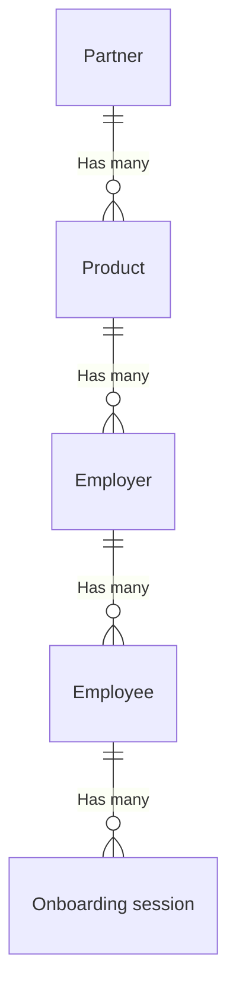
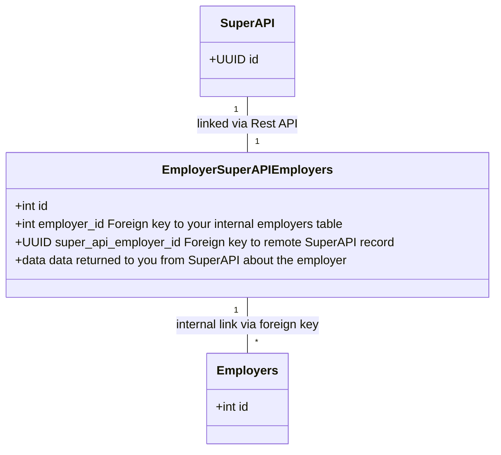

# Understanding SuperAPI entities

It can be a bit tricky to understand the entities that SuperAPI uses, in particular the entities that are used as the links between SuperAPI and your software. You might have come across these terms in our documentation or after we've been on a call together:

- Partner
- Product
- Employer
- Employee
- Onboarding session

This reference has been created as a shortcut to help you understand how these entities relate to each other and how they relate to objects in your system.

## Entities

The purpose of these entities is to model the relationship between your system and SuperAPI. They follow a strict hierarchy from the Partner at the top down to the onboarding session, in detail:

### Partner

The partner represents the relationship between SuperAPI and the software partner that is consuming our service. For most software partners, you don't need to worry too much about this entity as we take care of it for you. However, for some partners that have particular software configurations you will call API routes using the special partner key to dynamically create products.

::: info
This entity is managed by the SuperAPI team.
:::

### Product

The product represents your application. In most cases, you will have a singular product per environment. However there are cases where you may want to dynamically provision products using your partner API key. For example, if your application is instanced many times, one for each customer, or you use vanity url subdomains, you may want to dynamically create products.

We have no limit on the number of products you can create per partner. We suggest creating products when developing locally against our API.

Products start in a sandbox environment by default. Sandboxed products prevent you from calling real ATO or SuperFund APIs (we will instead simulate the calls). If you are creating products using a partner key, you can dynamically set the sandbox status of the product.

::: info
We will typically create you a product for production and for development when getting you set up.
:::

### Employer

The employer represents a business entity that is using your software. For example, if you have payroll software then the employer represents the organisation in your system with an ABN.

Depending on the SuperAPI functionality you want to enable, you might need to get the owner of the organisation (i.e. your customer) to perform one or more setup actions before you can use other functions in SuperAPI. For example, we require employers to select a default super fund before superannuation onboarding functions can be enabled.

::: info
This entity requires a `remote_id` field which can be used to map back to your system.
:::

### Employee

The employee represents a user entity who is employed by the employer. This entity should be unique per employer <> employee relationship in your system (e.g. if a user works at two organisations in your system, then we should have two matching employee records in SuperAPI, not one representing the underlying user). Currently this entity exists to provide future functionality such as superannuation payments via our SuperSend product and to allow our software partners to configure superannuation performance dashboards inside the application.

::: info
This entity requires a `remote_id` field which can be used to map back to your system.
:::

### Onboarding session

The onboarding session represents a one-off workflow that is given to a user to perform actions in SuperAPI via the embed. Onboarding Session actions include adding bank account/s, validating a phone number and nominating a superannuation fund to make contributions to.

::: info
This entity requires a `remote_id` field which can be used to map back to your system.
:::

## Tracking SuperAPI entities in your system

We highly suggest creating new database tables to track the relationship ("join") between the entities in your system (employers, employees) and the entities in SuperAPI. This provides a convenient indicator that the join between the systems has been created. It also allows you to store SuperAPI related information in a way that does not pollute the primary models in your system.

For example, to model the relationship between employers in your system and SuperAPI, your database could look like:

The `data` column in this case would model the JSON store in SuperAPI about the `employer` object. This would give you a convenient place to track the status of SuperAPI employers (for example, do they require a default super fund to be selected?). In this case, the remote_id provided to SuperAPI would be the primary key id of the `EmployerSuperAPIEmployers` record. This also creates a nice destination for webhook data to be stored after it has been fetched.
