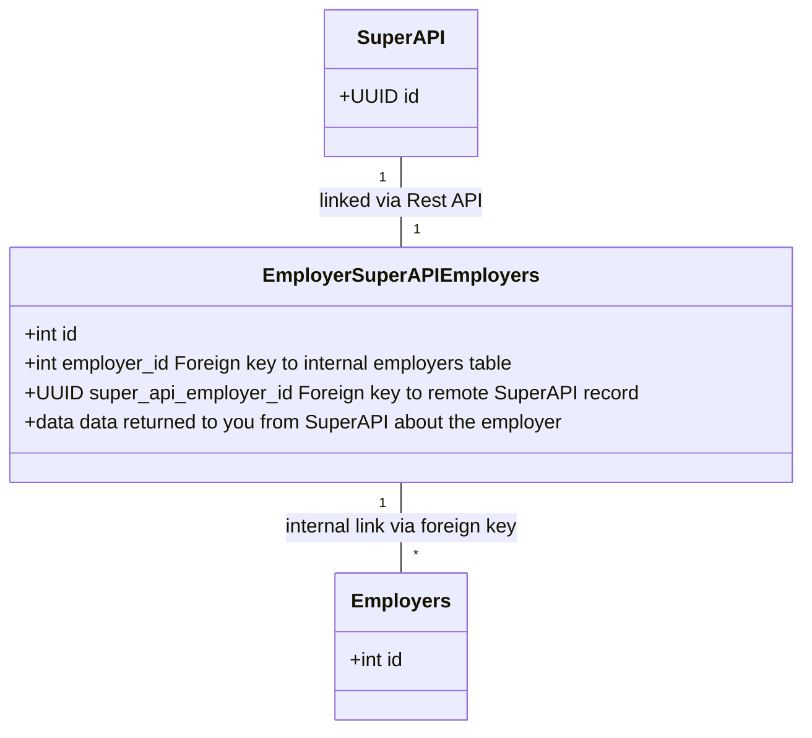

# Creating and working with employers

One of the core concepts in SuperAPI is that of an employer. The employer entity represents the owner of a business and as such, all actions related to a business will involved this employer entity in some form. In your system this may be called a "business" or "organisation" but the concept is the same.

Some of the actions in SuperAPI that require an employer are:

1. Showing the employer embed so that a default super fund and stapling can be configured.
2. Creating an onboarding session and showing the embed so that we can collect details like bank accounts or super selections from an employee.
3. Using our SuperSend product to transform SAFF files into ABA files so that super payments can be disbursed.

::: info
Before you start, make sure that you have [verified your product API key](/software_partners/how_to_guides/verify_my_product_api_key/index.html) is working correctly.
:::

## Anatomy of an employer

To create an employer in the system, at least three pieces of information are required.

1. The `abn` - This is the Australian Business Number (ABN) that this company is registered with at the ATO.
2. A `name` - The name of this company
3. A `remote_id` - The unique id of the employer (organisation, business, company etc) in your database. This is returned to you in webhook events so you can easily identify the record that the webhook is referencing.
4. A `product_id` - The id of the product that you are creating the employer under.

::: info
Don't know your `product_id`? You can [fetch the details](/software_partners/how_to_guides/verify_my_product_api_key/index.html) about a product by using the key associated with it.
:::

We have a number of other fields on an employer and the more details you can provide, the more functionality that can be unlocked in SuperAPI. To see the full list of attributes and an explanation of what they do, please consult our [Swagger documentation on employers](https://api.superapi.com.au/swaggerui#/employers/SuperApiWeb.Api.V1.EmployerController.create)

## Creating an employer

The following bash script can be used to create an employer object.

```bash
curl -X POST https://api.superapi.com.au/api/v1/employer \
  -H "Content-Type: application/json" \
  -H "x-api-key: superapi_yourapikeysDZFUnrDIyNp7YTAPDcJXge" \
  -d '{
    "name": "The company name",
    "abn": "12345",
    "remote_id": "12345"
  }'
```

::: info
Make sure you replace your `x-api-key` with the product key that has been given to you.
:::

After submitting the request above, you will be returned an employer object. It is a good idea to store that data against the record that it was created in your system. An example how how we do this is:



## Showing the employer embed

Once you have the employer object created, you can generate a secure URL to show the embed. This step allows an employer to configure details about themselves.

To create the embed URL:

```bash
curl -X POST https://api.superapi.com.au/api/v1/employer/:id/generate-embed-url \
  -H "Content-Type: application/json" \
  -H "x-api-key: superapi_yourapikeysDZFUnrDIyNp7YTAPDcJXge" \
  -d '{
    "options": {
      "valid_until": "2024-05-10T00:10:29Z"
    },
  }'
```

::: info
Make sure you set a `valid_until` in the future.
:::

Typically you would want to create these embed URLs on page load. I.e. each time an employer loads the page, you create a use a new embed url. As such, the `valid_until` should be a max of two hours. Consider how long it will take the employer to interact with the page (including getting up going for a break before coming back!). Google Chrome also has a tendency to unload pages in background tabs and reload them when the user returns to the page. A `valid_until` which is too low will cause an error when this happens.

::: danger
Generated URLs are sensitive. Anyone with access to the URL is authenticated as if they were the logged in user. Don't store generated URLs in the database.
:::

One you have the generated URL, [take a look at our JavaScript library](https://github.com/supersimplesuper/super-api-embed) which is designed to make it easy to work with them in the browser.
