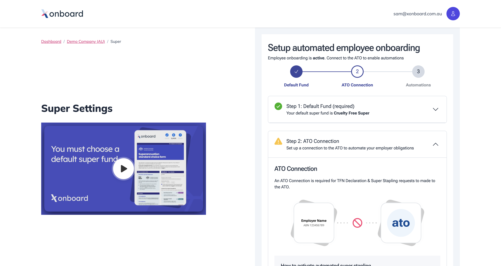

# Customising the look and feel

SuperAPI is designed to blend seamlessly into your product. Our goal is for users of your software to have no idea where your product stops and SuperAPI begins. For example, in the screenshot of our Xonboard product below, it is almost impossible to tell where Xonboard ends and SuperAPI begins unless you are familiar with the SuperAPI embeds already:

## What can be controlled?

We allow a large degree of flexibility when customising the embed. This includes:

* Fonts  
* Colours  
* Spacing  
* Borders  

We cannot allow full control such as uploading your own stylesheet, as we need to maintain some constraints when displaying content from our partners in the onboarding flow. For example, a fund may use a specific colour on its promoted fund tile, and we cannot override that.

## Making changes

To help you understand what can be changed, and to make the process straightforward, [we provide a REST endpoint](https://swagger.superapi.com.au/#/partner/superapiweb.api.v1.partners.customthemecontroller.post) that allows you to define variables in the system. This endpoint lists the variables available and explains which parts of the UI each one affects.

:::info
Behind the scenes these settings map to variables in our CSS stylesheet. You do not need to set every value, as we provide a base theme that your customisations build on.
:::

When you update these variables, the changes are deployed immediately to all products in your partner system.

## Creating your theme

When adding your theme, start small. SuperAPI has a base theme, so rather than setting every variable at once, try adjusting a single value and refreshing your browser to see the effect. Making small and frequent updates makes it easier to understand how each variable influences the design.

:::info
We are more than happy to help you implement your theme. Contact us at support@superapi.com.au and we can provide guidance or even create the first draft of your theme to get you started.
:::

## Beyond the variables

The variable system has been designed to let you safely make theme changes without affecting how the site functions. However, there are times when you may want to go beyond variable tweaks. For example, you may want to add drop shadows to certain cards. In these cases we can support adding additional custom styles to your theme, but you will need to work with us to ensure these changes do not impact site functionality.
