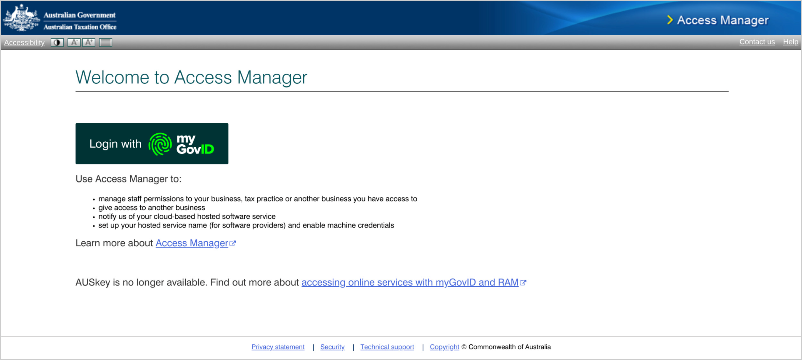
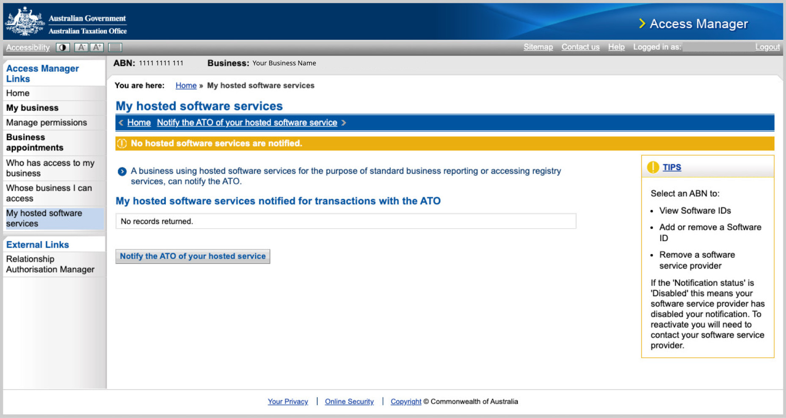
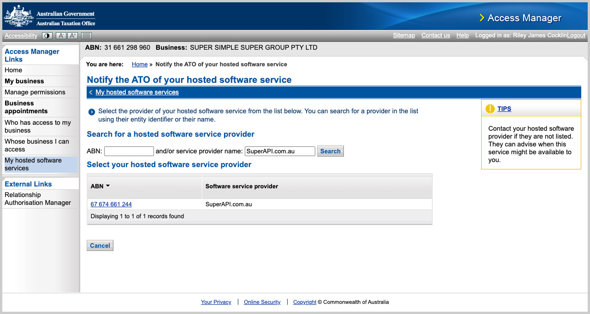
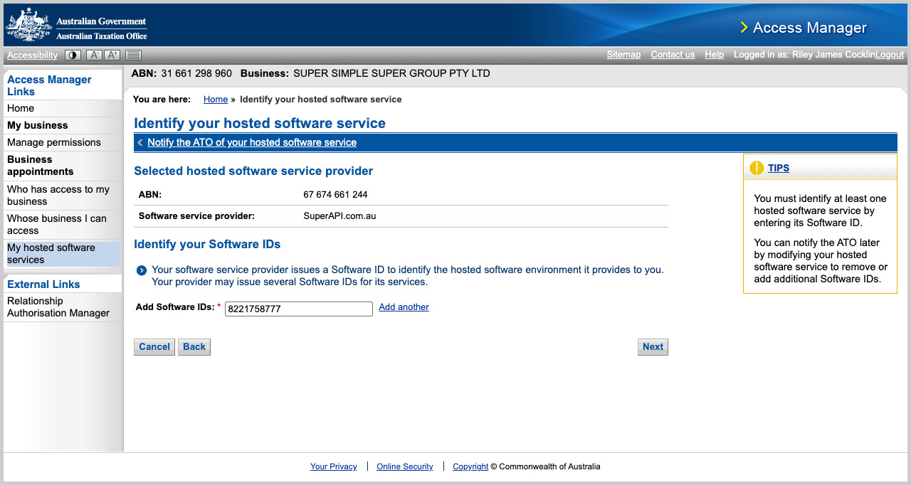
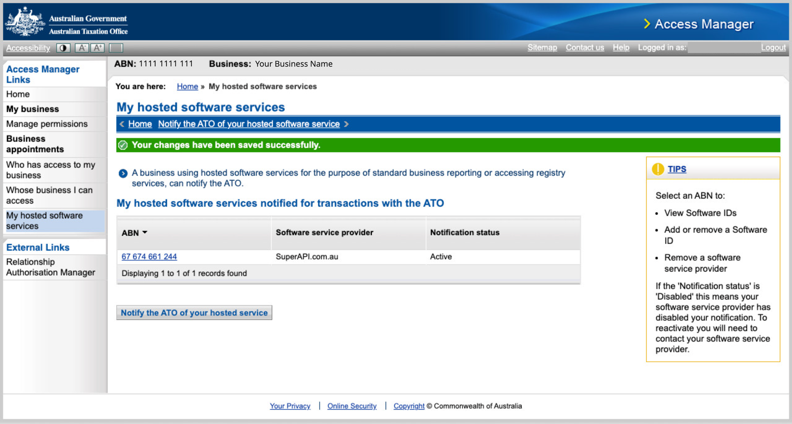

# How to activate automated super stapling with SuperAPI

To activate automated super stapling you must add SuperAPI.com.au as a hosted software service within your ATO Access Manager portal. This can be completed by the business owner or employer via the business entity's Access Manager portal. Alternatively, if the business is working with an advisor, their BAS or Tax agent can set this up for them via their agent portal. 

You can log in to ATO Access Manager using your MyGovID.

> **Note:** These instructions will activate both TFN Declarations & Super Stapling.

## Setup Instructions

### 1: Login to ATO Access Manager

- Login to [ATO Access Manager](https://am.ato.gov.au/) using your MyGovID

### 2: Select your business entity

- If you have access to multiple companies, select which company you'd like to authorise for Super Stapling and _click_ **"Continue"**.

### 3: Nominate SuperAPI as a hosted software service

- Under **"My hosted software services"**, _click_ **"Notify the ATO of a hosted service"**

- Search for the following provider details:
    - Provider name: **"SuperAPI.com.au"**
    - Provider ABN: **"67 674 661 244"**

- Select SuperAPI as the provider, then add the software ID (SSID): **"8221758777"**
- Click **"Next"**, then click **"Save"** to complete the authorisation.

### 4: Success

- You should now see **"SuperAPI.com.au"** as a hosted software service
- To verify that super stapling has been successfully authorised, return to **"Employer Setup"** and:
    - Complete the declaration
    - Provide agent details (if you are a BAS or Tax agent)
    - _Click_ **"Check ATO connection"**
- You've now successfully set up super stapling.

## Clickable demo: How to setup Super Stapling via ATO Access Manager

Check out our clickable demo, which guides you through the setup in the Access Manager portal and the final step required in the SuperAPI employer portal.

  <iframe loading="lazy" class="sl-demo" src="https://superapi.storylane.io/demo/wscwtzonluvr?embed=popup" name="sl-embed" allow="fullscreen" allowfullscreen style="position:absolute;top:0;left:0;width:100%!important;height:100%!important;border:1px solid rgba(63,95,172,0.35);box-shadow: 0px 0px 18px rgba(26, 19, 72, 0.15);border-radius:10px;box-sizing:border-box;"></iframe>

## FAQ: Help activating automated super stapling

### Unable to access ATO Access Manager?

If you receive an error when attempting to log in to ATO Access Manager then you do not have the required authorisations. You can log in to the [Resource Authorisation Manager (RAM)](https://authorisationmanager.gov.au/) to view your privileges. To log in to ATO Access Manager you will require the role of "Principal Authority" or "Authorisation administrator". You will also require "Full" level of access to the "Australian Tax Office (ATO)".

### Don't have a MyGovID?

If you don't have a MyGovID, you also won't have access to ATO Access Manager (AM), or Resource Authorisation Manager (RAM). You should speak to the owner of the business, finance team or payroll team and determine who has a MyGovID, and access to these portals. Once you have determined who has access, provide these instructions for them to complete.

###  My BAS or Tax agent has set this up in their Access Manager, do they need to enter anything in the employer portal?

Yes they will need to provide both their agent number and BAS or Tax agent entity ABN in the employer portal. After providing these details, they can click **"Check ATO connection"** and we'll make sure our SSID has been successfully associated with their agent details.

