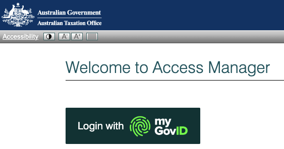
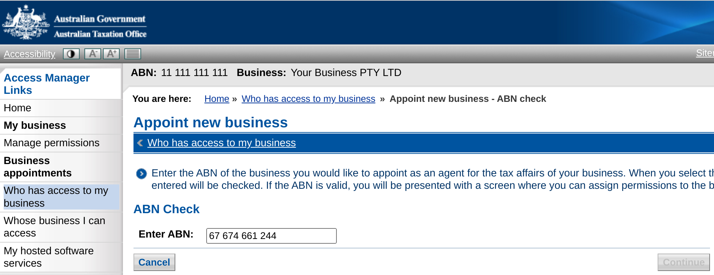
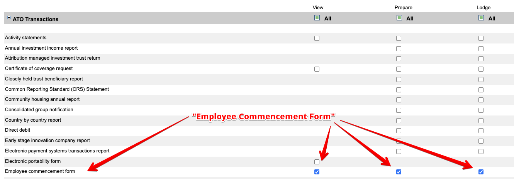
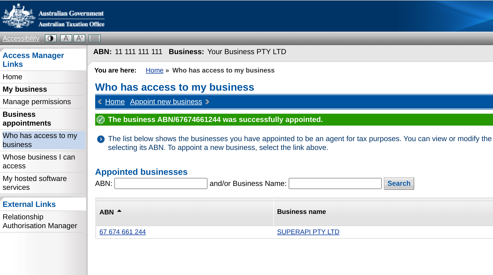

# How to active automated super stapling

To activate automated super stapling you must assign "SuperAPI Pty Ltd" as an appointed business to access ATO Online Services on your behalf (via API). This appointment is setup via ATO Access Manager, using your MyGovID.

In order to setup the appointment you must have "Principal Authority" or "Authorisation administrator" privileges within the business entity.

## Setup Instructions

### 1: Login to ATO Access Manager

- Login to [ATO Access Manager](https://am.ato.gov.au/) using your MyGovID

### 2: Select your business entity

- If you have access to multiple companies, select which company you'd like to authorise for Super Stapling and _click_ **"Continue"**

### 3: Appoint a new business

- Under **"Business Appointments"**, _click_ **"Who has access to my business"**
- Enter ABN: **"67 674 661 244"** to appoint **"SuperAPI Pty Ltd"** as your provider of ATO Online Services
- _Click_ **"Continue"**

### 4: Assign permissions

- Scroll down to **"Employee Commencement Form"**
- _Check_ all three boxes, **"View"**, **"Prepare"**, **"Lodge"**
- _click_ **"Save"**
- You should now see "SuperAPI Pty Ltd" under your appointed businesses

### 5: Success

- You should now see **"SuperAPI Pty Ltd"** under your appointed businesses.
- To verify that super stapling has been succesfully authorisation return to **"Employer Setup"** and _click_ the **"Check stapling activation"**.
- You've now successfully setup super stapling

## FAQ: Help activating automated super stapling

### Unable to access ATO Access Manager?

If you receive an error when attempting to login to ATO Access Manager then you do not have the required authorisations. You can login to the [Resource Authorisation Manager (RAM)](https://authorisationmanager.gov.au/) to view your privileges. To login to ATO Access Manager you will require the role of "Principal Authority" or "Authorisation administrator". You will also require "Full" level of access to the "Australian Tax Office (ATO)".

### Don't have a MyGovID?

If you don't have a MyGovID, you also won't have access to ATO Access Manager (AM), or Resource Authorisation Manager (RAM). You should speak to the owner of the business, finance team or payroll team and determine who has a MyGovID, and access to these portals. Once you have determined who has access, provide these instructions for them to complete.
