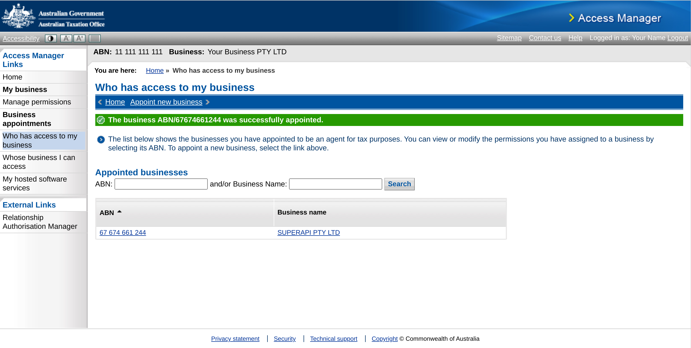

# How to active automated super stapling

To activate automated super stapling you must assign "SuperAPI Pty Ltd" as an appointed business to access ATO Online Services on your behalf (via API). This appointment is setup via ATO Access Manager, using your MyGovID. In order to setup the appointment you must have "Principal Authority" or "Authorisation administrator" privileges within the business entity.

1. Login to [ATO Access Manager](https://am.ato.gov.au/) using your MyGovID

2. If you have access to multiple companies, select which company you'd like to authorise for Super Stapling and click "Continue"
3. Click this link to ["Appoint New Business"](https://am.ato.gov.au/Xea/CreateAppointment.aspx). Alternatively, to reach the same location, under "Business Appointments" in the left hand navigation menu, click "Who has access to my business" and then click ["Appoint New Business"](https://am.ato.gov.au/Xea/CreateAppointment.aspx).
4. Enter ABN: "67 674 661 244" to appoint "SuperAPI Pty Ltd" as your provider of ATO Online Services, and click "Continue".

5. Verify the business name shown is "SuperAPI Pty Ltd". Then scroll down to "Employee Commencement Form", and check all three boxes "View", "Prepare" and "Lodge". Click "Save".

6. Success. You should now see "SuperAPI Pty Ltd" under your appointed businesses.

Alternatively, you want to pre-enable future SuperAPI features which leverage ATO Online Services you can select "Access to all online functionality (including future enhancements) for my business".

## FAQ: Help activating automated super stapling

### Unable to access ATO Access Manager?

If you receive an error when attempting to login to ATO Access Manager then you do not have the required authorisations. You can login to the [Resource Authorisation Manager (RAM)](https://authorisationmanager.gov.au/) to view your privileges. To login to ATO Access Manager you will require the role of "Principal Authority" or "Authorisation administrator". You will also require "Full" level of access to the "Australian Tax Office (ATO)".

### Don't have a MyGovID?

If you don't have a MyGovID, you also won't have access to ATO Access Manager (AM), or Resource Authorisation Manager (RAM). You should speak to the owner of the business, finance team or payroll team and determine who has a MyGovID, and access to these portals. Once you have determined who has access, provide these instructions for them to complete.
