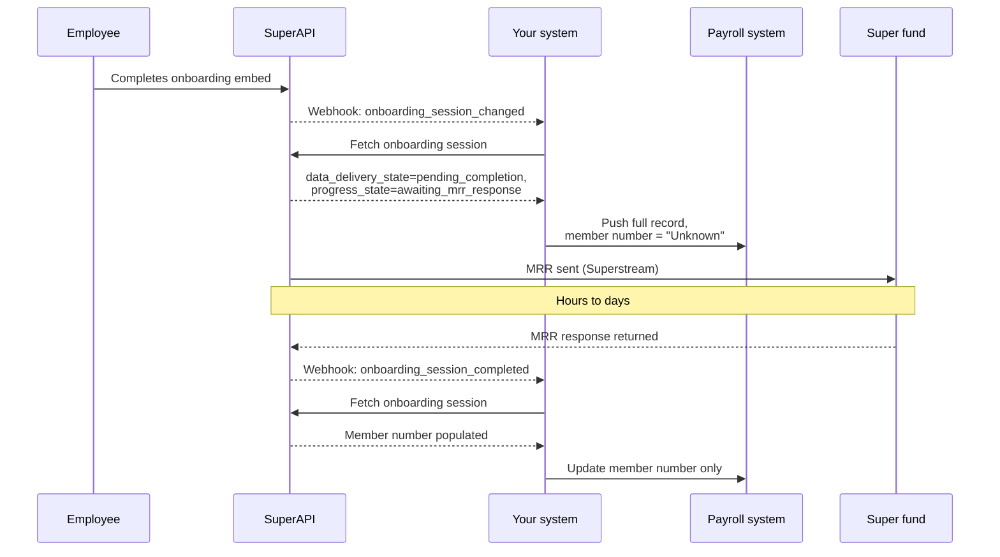

# Syncing data to third party systems

Employees often complete onboarding close to their start date or first payday, and their record in your payroll system needs to be in place by then. Some of the information SuperAPI collects relies on asynchronous processes, most notably Member Registration Requests (MRRs), which are sent over Superstream and can take anywhere from an hour to a few days to return. If you wait for every async process to resolve before pushing anything to your payroll system, you will regularly miss payroll cut-offs. This page describes how to sync data as early as possible, then update it progressively as results arrive, so the employee's payroll record is ready when it needs to be.

## Reduce the problem at the source

Most of the pain around MRRs comes from two related cases: a fund takes a long time to respond, or it never responds at all. Both are most acute when an employee abandons onboarding, because that is the point at which SuperAPI has to resolve their super on their behalf rather than the employee choosing a fund directly. The biggest improvement you can drive is getting employers to set up the ATO stapling connection. During abandonment, SuperAPI looks up the employee's stapled fund via the ATO first; if one is found, we return it and no MRR is sent. Only when no stapled fund is available do we fall back to registering the employee with the employer's default fund via an MRR, which is where a multi-day delay (or no response at all) can occur. See [lifecycle of an onboarding session](/software_partners/explanations/lifecycle_of_an_onboarding_session/index.html) for the full abandonment decision flow.

A related lever sits with you. If you already know the employee's super fund at the point you create the onboarding session (for example, when they are updating existing details rather than onboarding for the first time), pass those details through in the creation payload. On abandonment, SuperAPI will return the fund you gave us instead of stapling and defaulting.

::: tip
The ATO connection is set up by the employer, not the partner, but you are the one who can drive them towards it. The employer endpoint returns an `onboarding_status` field and an `onboarding_configuration` object (including `default_fund_configured`, `stapling_enabled`, and `tfnd_enabled`) that you can read to render setup nudges, banners, or checklists in your product until the employer is fully configured. See [Activate stapling](/software_partners/how_to_guides/stapling-setup-instructions/index.html) for the setup steps you can pass on to them.
:::

Even with both of these in place, some sessions will still wait on an MRR response. The rest of this page covers how to handle that delay without blocking your sync.

## The two fields that describe what is still pending

SuperAPI exposes two fields that together tell you whether an onboarding session has data still resolving, and what specifically is outstanding.

`data_delivery_state` lives on the onboarding session itself and describes the state of the session as a whole. The value you act on for sync decisions is `pending_completion`, which means the employee has finished interacting with the embed but at least one sub-module is still resolving in the background. Once every sub-module has resolved, this transitions to `completed`.

`onboarding_session_super_selection.progress_state` lives on the super selection module and describes the state of the super selection specifically. The values that matter for sync decisions are:

- `awaiting_mrr_response`: an MRR has been sent to a fund and we are waiting for the response. Fund details (ABN, USI, fund name) are all known, but the member number is not.
- `registering`: we are about to send an MRR. Treat this the same as `awaiting_mrr_response` for sync purposes.
- `completed`: the super selection is fully resolved. The super selection's `outcome` field tells you whether the final result includes a member number.

You can usually drive sync decisions from `data_delivery_state` and the super selection's `outcome` (see [lifecycle of an onboarding session](/software_partners/explanations/lifecycle_of_an_onboarding_session/index.html) for the full list of outcomes). Reach for `progress_state` when you need to distinguish "we are still waiting for the fund to respond" from "we tried and gave up".

::: info
Super is the only sub-module that currently drives `pending_completion`, but that will not always be the case. Future modules such as police checks will also have asynchronous outcomes. Treating `data_delivery_state` as the general "is anything still resolving?" signal, and each module's own state field as the source of module-specific detail, means your integration will keep working as we add modules.
:::

## The partial sync pattern

Rather than waiting for `onboarding_session_completed` before touching your payroll system, push what you have once the employee finishes the embed and update the remaining fields as results arrive.

The flow looks like this:

In practice:

1. Listen for `onboarding_session_changed`. When the session's `data_delivery_state` is `pending_completion`, fetch the onboarding session.
2. If the super selection's `progress_state` is `awaiting_mrr_response` (or `registering`), push the fund details you have to your payroll system, using a placeholder for the member number. `Unknown` and `Pending` are both common choices; the exact value does not matter so long as your payroll system accepts it and your own code can recognise it later. Xonboard (our Xero onboarding app) uses `Unknown`.
3. Listen for `onboarding_session_completed`. When it fires, fetch the session again and update only the member number on the existing fund record, rather than re-pushing the whole employee record.

Keeping the second update narrow has a nice side benefit: it will not clobber anything the employer has changed directly in payroll between the two syncs. Whether you can apply the same "update only what changed" principle to other fields depends on the payroll system you are integrating with, so take this as a pattern to adapt rather than a rule to apply verbatim.

## What to do in each state

Use the table below as a rule of thumb rather than an exhaustive spec; your own product requirements may call for different behaviour, especially around `complete_without_member_number`.

| `data_delivery_state` | Super selection state | What to do |
| --- | --- | --- |
| `initial` or any `collect_*` value | Session still in progress | Do nothing. The employee has not finished the embed. |
| `pending_completion` | `progress_state` is `registering` or `awaiting_mrr_response` | Partial sync: push all details with a placeholder member number. |
| `pending_completion` | Any other `progress_state` | Wait. The session will either complete or advance to a state you can act on. |
| `completed` | `outcome` is `complete` | Full sync if you have not synced yet. If you already partial-synced, update the member number only. |
| `completed` | `outcome` is `complete_without_member_number` | Sync what you have and flag the employee for follow-up. The employer will need to collect fund details directly or resolve the membership through their default fund manually. |
| `abandoned` then `completed` | Depends on outcome | Same handling as the matching `completed` outcome above. Abandonment flows still resolve to either `complete` or `complete_without_member_number`. See the [lifecycle guide](/software_partners/explanations/lifecycle_of_an_onboarding_session/index.html) for how abandonment resolves. |

## Related reading

- [Lifecycle of an onboarding session](/software_partners/explanations/lifecycle_of_an_onboarding_session/index.html) for the super selection `outcome` values and the abandonment decision flow.
- [List of webhooks](/software_partners/references/list_of_webhooks/index.html) for the payloads of `onboarding_session_changed` and `onboarding_session_completed`.
- [Common gotchas](/software_partners/common_gotchas/index.html) for race conditions to be aware of when reacting to `onboarding_session_completed`.
- [Understanding member verification](/software_partners/how_to_guides/member_verification/index.html) for the related question of whether it is safe to actually pay a given fund before sending a contribution.
- [Activate stapling](/software_partners/how_to_guides/stapling-setup-instructions/index.html) for the ATO setup steps employers need to complete.

<!--@include: @/parts/getting_help.md-->
