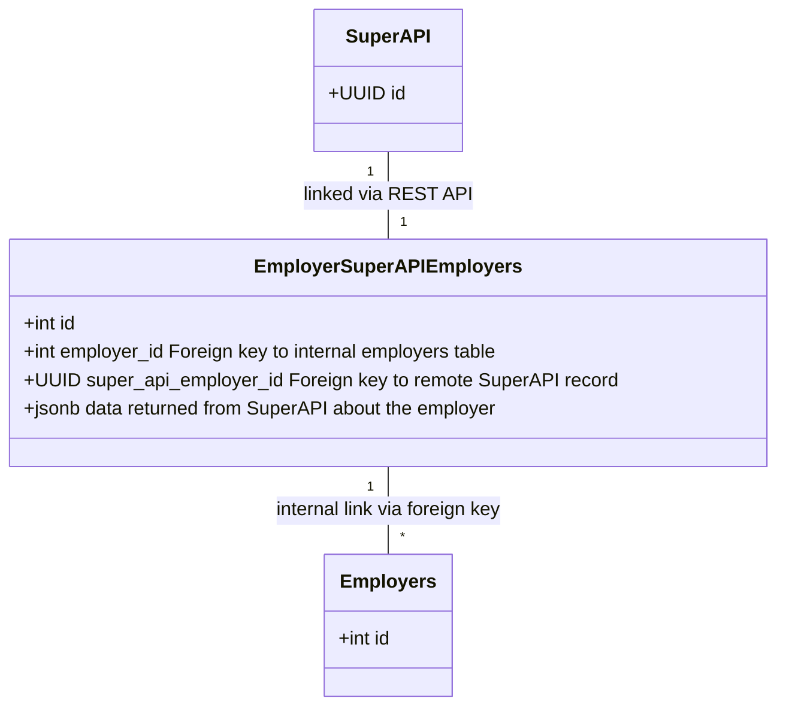
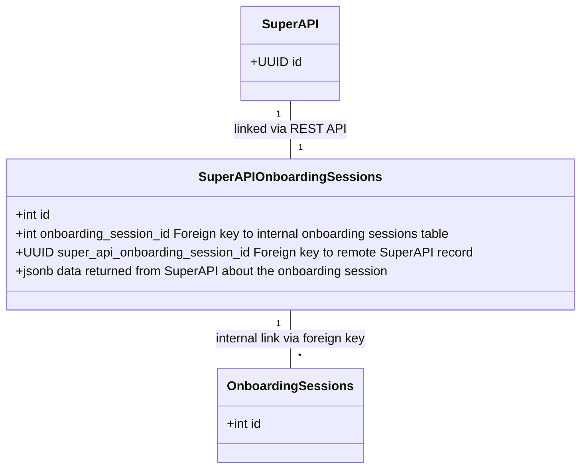

# Designing Your SuperAPI Integration

This guide covers how to think about SuperAPI architecturally - where it fits in your product, how data flows between your system and ours, and how to model SuperAPI entities alongside your own. If you're looking for a hands-on walkthrough of making your first API calls, start with the [getting started guide](/software_partners/getting_started/index.html).

## Overview

At a high level, a SuperAPI integration has two phases: setting up an employer, then onboarding their employees. The following diagram shows how data flows between your product and SuperAPI across both phases.

Solid arrows represent synchronous API calls and user actions. Dashed arrows represent asynchronous events (webhooks and post-messages) sent by SuperAPI.

```mermaid
sequenceDiagram
    autonumber
    participant P as Your Product
    actor Employer as Employer
    actor Employee
    participant S as SuperAPI

    rect rgb(40, 40, 60)
        note over P,S: Employer setup
        P->>S: Create employer entity
        P->>S: Generate employer embed URL
        S->>P: Embed URL response
        P->>Employer: Present employer embed via iFrame
        Employer->>S: Configures settings via the embed
        S-->>P: Webhook: employer_settings_changed
        S-->>P: Post-message: "changed" / "committed"
        P->>P: Process employer configuration
    end

    rect rgb(40, 60, 40)
        note over P,S: Employee onboarding
        P->>Employee: Begin onboarding process
        Employee->>P: Completes earlier onboarding steps
        P->>S: Create onboarding session with employee details
        S->>P: Onboarding session response
        P->>S: Generate onboarding embed URL
        S->>P: Embed URL response
        P->>Employee: Present onboarding embed via iFrame
        Employee->>S: Completes onboarding session
        S-->>P: Post-message: employee is done
        P->>Employee: Close iFrame / continue to next step
        S-->>P: Webhook: onboarding_session_completed
    end
```

You can try this flow yourself by following the [getting started guide](/software_partners/getting_started/index.html), which walks through each of these steps with real API calls.

## Employers

Each new employer must be set up in SuperAPI before their employees can be onboarded. This is a two-step process: first you create the employer entity via the API, then you present the employer embed so the employer can complete their configuration (e.g. selecting a default super fund).

Employer entities contain information about the business that the employee is onboarding with, including the name, ABN, and default super fund. We suggest creating a join table to map the relationship between employers in your system and employer entities in SuperAPI. In a relational database, this could look like:

With this join table in place, you have a way of linking employer records in your system with the corresponding entities in SuperAPI.

For more on how employers fit into the SuperAPI data model, see [understanding SuperAPI entities](/software_partners/explanations/understanding_super_api_entities/index.html).

## Onboarding sessions

Onboarding sessions are the core of a SuperAPI integration. The process is two steps: create the session via the API with any employee details you already have, then present the onboarding embed via iFrame for the employee to complete.

SuperAPI is typically not the first step in your onboarding process. The employee details you've already collected through earlier steps can be passed when creating the session, and SuperAPI will use them to prefill fields so the employee doesn't need to re-enter information. Some functionality (such as stapling and presenting existing super funds) depends on these details, but will gracefully degrade if they're not provided.

Unlike the employer embed, onboarding sessions are ephemeral. An employee will have at least one, but may have more. For example, you might require employees to revisit their super selection annually to ensure they're making optimal choices. In this case, the employee would have two onboarding sessions, each a year apart.

The join table pattern used for employers works well for onboarding sessions too:

For more on how onboarding sessions fit into the SuperAPI data model, see [understanding SuperAPI entities](/software_partners/explanations/understanding_super_api_entities/index.html).

## How data flows back to you

SuperAPI communicates back to your system through two channels:

- **Post-messages** are sent via the iFrame in real time. These tell your frontend when something has happened, for example when an employer has committed their configuration or when an employee has finished interacting with the onboarding session. Use these to drive your UI - closing the iFrame, showing a success message, or moving the user to the next step.

- **Webhooks** are sent server-to-server to the webhook URL configured on your product. These are your backend's notification that something has changed in SuperAPI. Webhook payloads are intentionally minimal - they contain an event type, the entity ID, and a URL to fetch the full data. Your system should fetch the relevant entity from the API when it receives a webhook rather than relying on the webhook payload alone.

::: info
Post-messages and webhooks don't always arrive at the same time. The post-message tells you the user is done interacting, but the webhook may arrive later if SuperAPI is still processing (e.g. waiting for a fund registration via the Superstream network). See [common gotchas](/software_partners/common_gotchas/index.html#webhook-race-conditions) for more detail on handling this.
:::

For further reading:

- [List of webhooks](/software_partners/references/list_of_webhooks/index.html) - all webhook events and their payloads
- [Webhook security](/software_partners/how_to_guides/webhook_security/index.html) - verifying webhooks with HMAC
- [Work with webhooks locally](/software_partners/how_to_guides/work_with_webhooks_locally/index.html) - testing with ngrok during development

<!--@include: @/parts/getting_help.md-->
