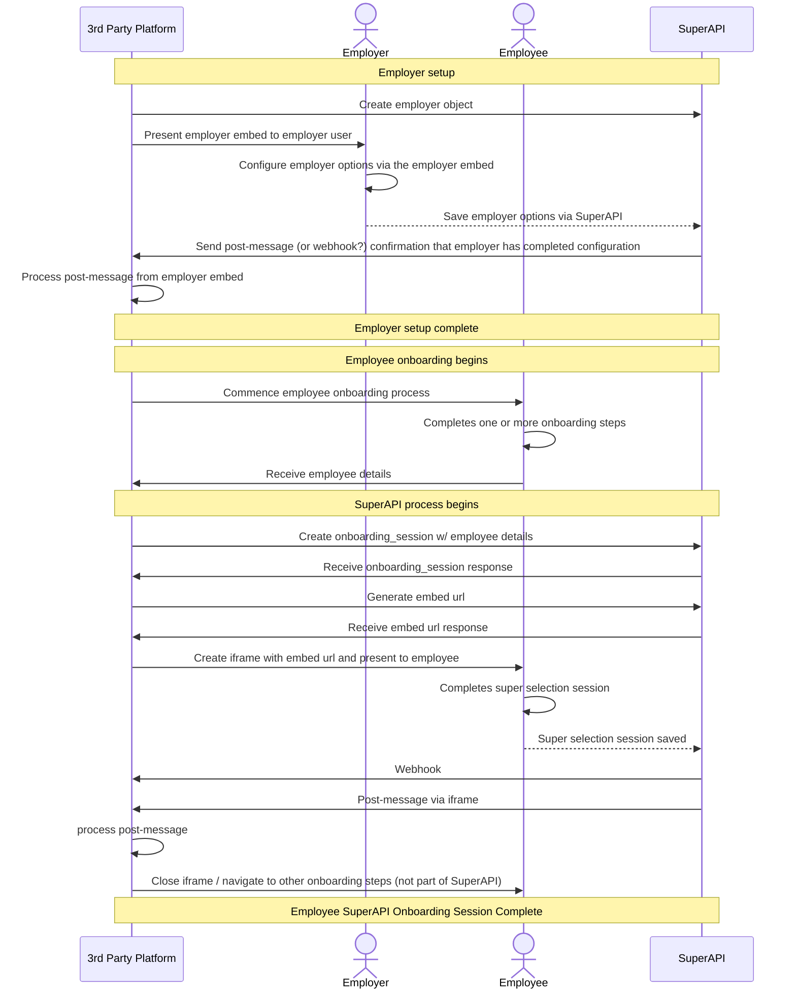
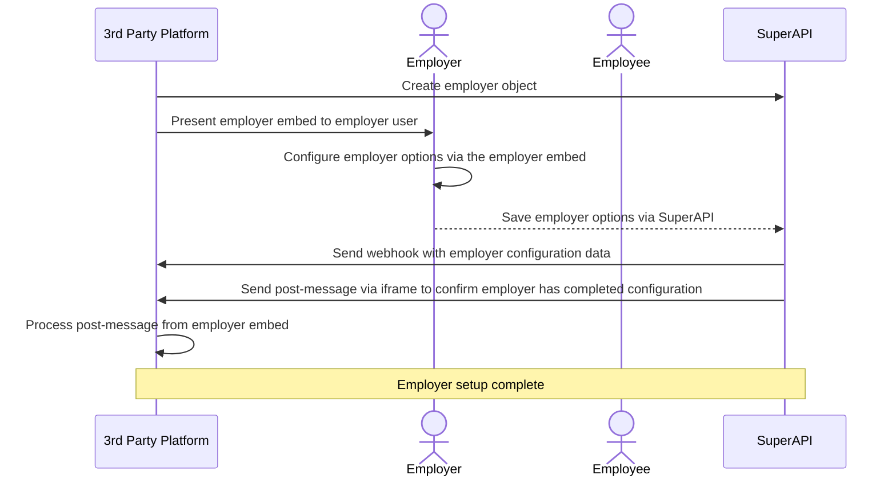
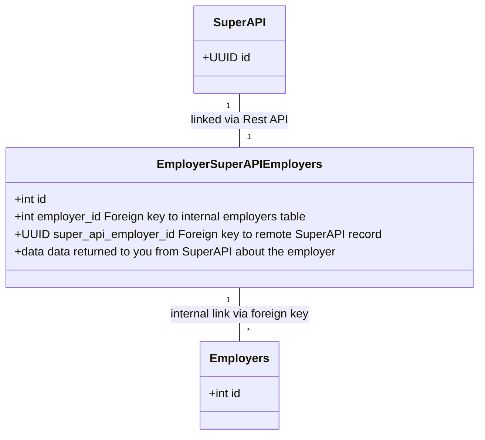
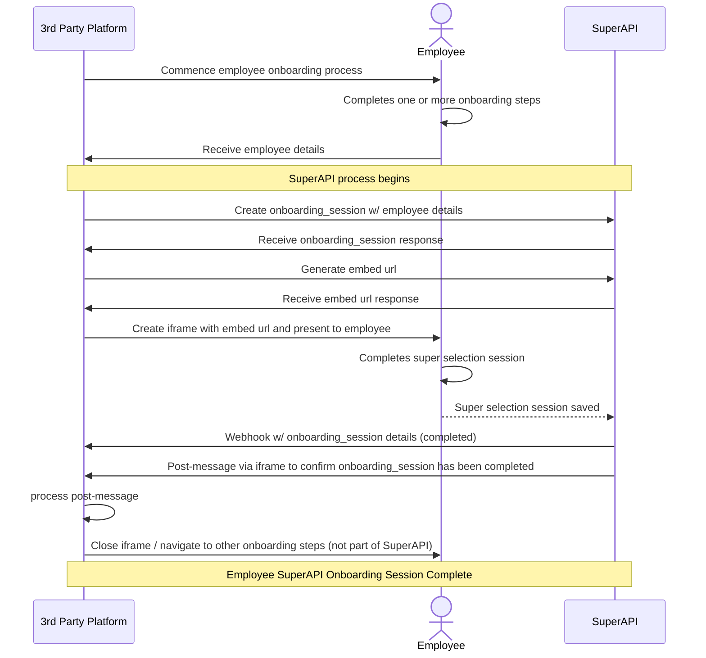
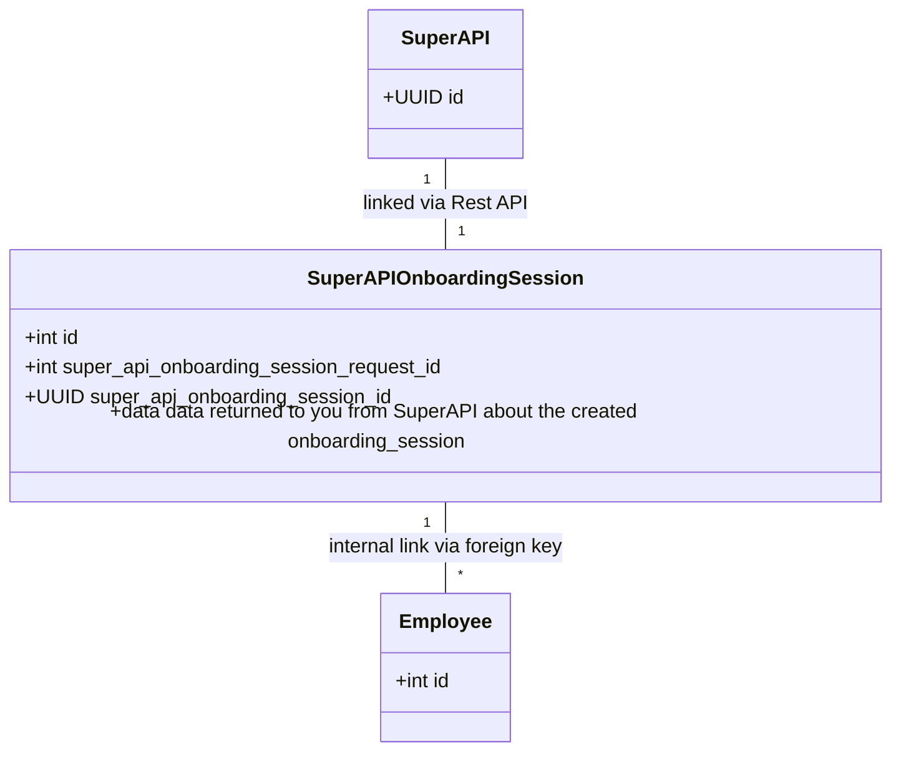

# Integrating SuperAPI

The following is a detailed step by step tutorial on how to integrate SuperAPI into your product.

<!--@include: @/parts/getting_help.md-->
<!--@include: @/parts/terminology.md-->

## Changelog

| Date       | Change                                                                                                     |
| ---------- | ---------------------------------------------------------------------------------------------------------- |
| 05/08/2024 | Removed detailed information and provided links to guides instead, moved to tutorials section              |
| 10/05/2024 | `valid_until` changed to be an ISO8601 timestamp for consistency                                           |
| 08/05/2024 | Documented disclaimers and bank accounts                                                                   |
| 07/05/2024 | Generated PDF super assets moved under the onboarding_session_super_selection                              |
| 16/04/2024 | Return more fields on `employee_detail`'s                                                                  |
| 08/04/2024 | Add more detail on the `expires_at` column for `onboarding_session`'s                                      |
| 21/03/2024 | Added `middle_name` and `has_financial_supplement_debt` to employee creation                               |
| 20/03/2024 | Added `casual` and `labour_hire` pay basis enums                                                           |
| 06/03/2024 | Indicate that the TFN under the `super_fund_member_detail` response can be null                            |
| 05/03/2024 | Modified endpoint from `v2.superapi.com.au` to `api.superapi.com.au`                                       |
| 15/02/2024 | Added `other` type for gender (free form entry coming soon). Added additional titles.                      |
| 15/02/2024 | Converted enums to be lowercase, added additional tax fields to employees and address details to employers |
| 02/02/2024 | Added an example payload for the onboarding session webhook response                                       |
| 29/01/2024 | Public release of the docs                                                                                 |

## Getting setup

Make sure you read the [Overview](/software_partners/explanations/overview/index.html) so you have an understanding of how SuperAPI integrates with 3rd party products. This document has been designed to give you a high level overview of how the pieces of software, i.e. your product and SuperAPI, fit together. That high level understanding will make the following detailed process much easier to follow.

### Obtaining your API keys

The first step is to obtain your API keys from SuperAPI. These API keys identify your software to SuperAPI and allows you to create and read data from our system. If you have not obtained your keys yet then please email sam@superapi.com.au to have one provisioned.

Depending on your setup, we can provision keys for your staging and local development environments (it is also possible for developers to share a key). Once you're happy with your implementation of SuperAPI then get in touch with us and we can provision you production keys for use in your live environment.

If your software is not multi-tenanted then please talk to us about how to programmatically generate api keys for each of your instances. Ideally you should have only one production key but in some software architectures it may make sense to generate API keys for each instance of your production software.

::: danger
Your api key is sensitive data and should be treated as such. With it, personal information about the sessions your users have created in SuperAPI can be read. Ensure it is not checked into your source code repository.
:::

#### What is the sandbox?

Sandboxed instances of SuperAPI are made for development and testing purposes. Sandboxed instances have the same functionality as non sandboxed (production) instances. Sandboxed instances are restricted from interacting with external services, such as Super Fund & ATO services. This protects your development & testing environments from accidentally interacting with any external production systems.

This does not impact how you can integrate with SuperAPI, as any required external services are mocked to enable the required functionality within the sandbox. Only the experience that users will have when going through a super selection flow is impacted.

### Details needed to create your API key

When we create your API key, we will need some details about you. These are:

| Field               | Description                                                                                                                                                                                                                         |
| ------------------- | ----------------------------------------------------------------------------------------------------------------------------------------------------------------------------------------------------------------------------------- |
| product_name        | Name of your product that will be using the API key                                                                                                                                                                                 |
| webhook_url         | The callback URL that will be used to send data as it changes in our system                                                                                                                                                         |
| target_origin       | Target origin so we can safely broadcast iFrame message to the secured destination (need help? [Read the MDN docs on `targetOrigin` for iFrames](https://developer.mozilla.org/en-US/docs/Web/API/Window/postMessage#targetorigin)) |
| show_toast_messages | If we should show toast messages in the iFrame. Disable this if you want to hook our JavaScript API into your toast display system to create seamless notifications.                                                                |

In addition to the API key, you will also be provided a unique token which has been generated by us that you can use to identify webhook as originating from our system.

## SuperAPI Overview

## Our REST endpoints

All calls to our Rest endpoints will return the same structured metadata, this is represented as:

| Field   | Kind   | Description                                                                                                  |
| ------- | ------ | ------------------------------------------------------------------------------------------------------------ |
| data    | object | The serialised object in our system                                                                          |
| version | string | The version of serialised data. This will match the version in the endpoint that the record was created with |

## Employer setup process

Each new employer must be setup in SuperAPI before they can begin onboarding their employees. Setting up an employer is a two step process. First the employer must be created via the API. Then the employer embed must be presented to a user of the employer so they can configure their employer settings.

### Overview

## Employer endpoint

### Creating employers

An `employer` object must be created before an employee can be onboarded via SuperAPI. Employer objects contain information about the employer that the employee is onboarding with. This can include the name, abn and default super fund for the employer.

::: warning
If you don't configure an employer and attempt to create an onboarding session, you will receive an error! Please ensure that your system prevents onboarding sessions being created for an employer until the employer object has been created, and you've presented the employer configuration embed to a member of the employer team.
:::

We suggest that you create a table to map the relationship between the employer in your system and the employer object in SuperAPI. In a relational database system, this could look like:

With this join table in place, you will have a way of linking the employer record in your system with the employer object that is in SuperAPI.

Once you are ready to create employers, please see the documentation on how to [create an employer](/software_partners/how_to_guides/create_an_employer/index.html)

## Onboarding session

The process of onboarding a new employee with SuperAPI is a two step process. First an onboarding session is created, then the employee is presented with the employee embed (iframe), via which they can complete their super selection.

It is assumed that the SuperAPI super selection step is **not** the first step within your employee onboarding process. Based on this assumption, it is also assumed that you will bootstrap the the onboarding session with employee details that have been collected through the other steps in your employee onboarding journey. The employee details you provide to the onboarding session will be use to prefill any details the employee is required to enter. Some functionality within the employee onboarding session is dependent on employee details (such as stapling / presenting existing super funds) but these features will gracefully degrade if the employee details are not provided (or are invalid).

Unlike the employer embed, the onboarding session is ephemeral. It is expected that a user will have at least one onboarding session but may have more. For example, you may want to require the user to come back to your system to make another super selection after a year to ensure they are making optimal choices about the super fund that they use. In this case, the employee would have two onboarding sessions, each a year apart.

### Overview

Once you are ready to create onboarding sessions, please see the documentation on how to [work with onboarding sessions](/software_partners/how_to_guides/work_with_onboarding_sessions/index.html)

Designing database tables to support the SuperAPI onboarding sessions is similar to the way the employer <> SuperAPI relationship works:

## Webhooks

Webhooks exist as the primary mechanism to transport data from SuperAPI back to the partner website. Webhooks will always deliver to the same URL (this is configured when we provision your partner account, contact us if you need to update this) but will be wrapped in metadata to help distinguish the event that triggered the webhook.

Please see the [list of webhooks](/software_partners/references/list_of_webhooks/index.html), how to [work with webhooks locally](/software_partners/how_to_guides/work_with_webhooks_locally/index.html) and how [webhook security](/software_partners/how_to_guides/webhook_security/index.html) works.

## Payloads

For detailed information on the data that is sent to and from the API, please view our [live swagger spec](https://api.superapi.com.au/swaggerui),
