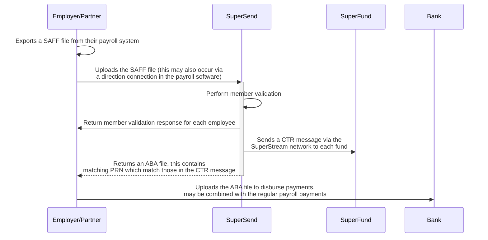

# The SuperSend sequence

The following diagram outlines at a high level the entities involved when using SuperSend and what each entity does:

## In detail

1. The Employer exports a SAFF file from their payroll system.
2. The Employer uploads the SAFF file to SuperSend.
3. SuperSend validates the details within the SAFF File

   i. Validates the SAFF file against the spec

   ii. Validate each super fund's details (usi & abn)

   iii. Validate each members details

4. Return employee/member validation details.

5. Perform contribution process:

   i. Creates a CTR message for each Superfund.

   ii. Creates a single banking ABA file for the Employer that contains line items for each Superfund that match the associated CTR messages.

   iii. Returns the ABA file to the Employer, via the Employer’s payroll software.

   iv. Sends the CTR messages to each Superfund, via the STN, including the matching PRN (Payment Reference Number), as provided to the Employer via the ABA file.

6. The Employer processes, via their banking system, a single ABA file (as created
   by SuperSend) for the total value of all the employees’ superannuation
   contributions, and
7. Where the Employer’s payroll software supports it, the line items of this ABA
   file may be combined with the payroll line items, typically PAYG to individual
   employee’s bank accounts. This delivers the benefit of a single ABA file import
   to the Employer’s internet banking or bank-connected payroll software to
   remit all payroll and superannuation payments for the pay run.
   Most of this process is real-time, with the slowest part being the bank’s processing of
   the Employer’s ABA payment file ... between 4 and 24-hours, but up to 72 hours
   depending on a bank’s inter and intra-day cut-offs and disbursement policies.
